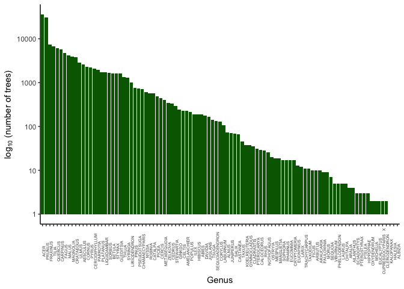
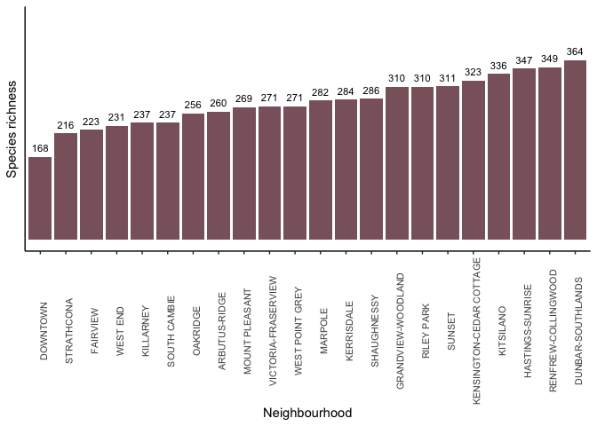
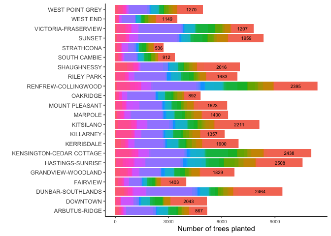
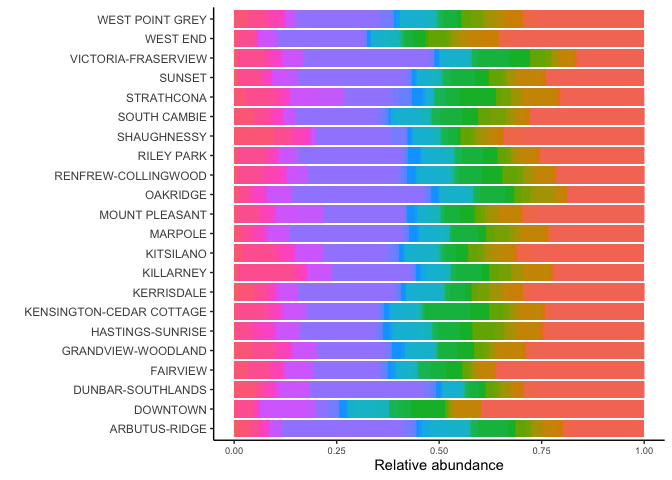
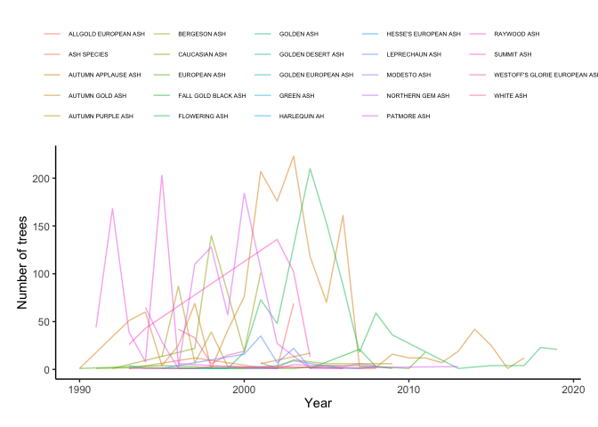
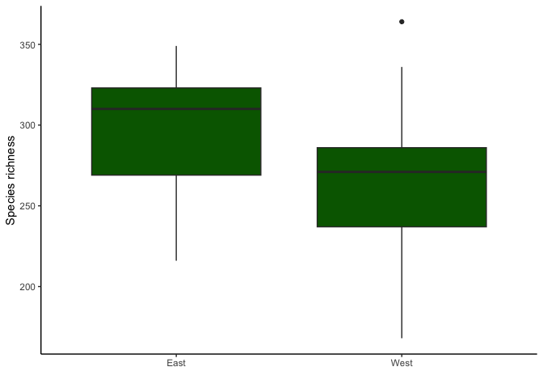

Mini Data-Analysis Deliverable 2
================
Nicola Rammell

- [Welcome to the rest of your mini data analysis
  project!](#welcome-to-the-rest-of-your-mini-data-analysis-project)
- [Instructions](#instructions)
- [Learning Objectives](#learning-objectives)
- [Setup](#setup)
- [Task 1: Process and summarize your
  data](#task-1-process-and-summarize-your-data)
  - [1.1 (1 point)](#11-1-point)
  - [1.2 (8 points)](#12-8-points)
  - [1.3 (2 points)](#13-2-points)
- [Task 2: Tidy your data](#task-2-tidy-your-data)
  - [2.1 (2 points)](#21-2-points)
  - [2.2 (4 points)](#22-4-points)
  - [2.3 (4 points)](#23-4-points)
- [Task 3: Modelling](#task-3-modelling)
  - [3.0 (no points)](#30-no-points)
  - [3.1 (3 points)](#31-3-points)
  - [3.2 (3 points)](#32-3-points)
- [Task 4: Reading and writing data](#task-4-reading-and-writing-data)
  - [4.1 (3 points)](#41-3-points)
  - [4.2 (3 points)](#42-3-points)
- [Overall Reproducibility/Cleanliness/Coherence
  Checklist](#overall-reproducibilitycleanlinesscoherence-checklist)
  - [Coherence (0.5 points)](#coherence-05-points)
  - [File and folder structure (1
    points)](#file-and-folder-structure-1-points)
  - [Output (1 point)](#output-1-point)
  - [Tagged release (0.5 point)](#tagged-release-05-point)
    - [Attribution](#attribution)

*To complete this milestone, you can edit [this `.rmd`
file](https://raw.githubusercontent.com/UBC-STAT/stat545.stat.ubc.ca/master/content/mini-project/mini-project-2.Rmd)
directly. Fill in the sections that are commented out with
`<!--- start your work here--->`. When you are done, make sure to knit
to an `.md` file by changing the output in the YAML header to
`github_document`, before submitting a tagged release on canvas.*

# Welcome to the rest of your mini data analysis project!

In Milestone 1, you explored your data and came up with research
questions. This time, we will finish up our mini data analysis and
obtain results for your data by:

- Making summary tables and graphs
- Manipulating special data types in R: factors and/or dates and times.
- Fitting a model object to your data, and extract a result.
- Reading and writing data as separate files.

We will also explore more in depth the concept of *tidy data.*

**NOTE**: The main purpose of the mini data analysis is to integrate
what you learn in class in an analysis. Although each milestone provides
a framework for you to conduct your analysis, it’s possible that you
might find the instructions too rigid for your data set. If this is the
case, you may deviate from the instructions – just make sure you’re
demonstrating a wide range of tools and techniques taught in this class.

# Instructions

**To complete this milestone**, edit [this very `.Rmd`
file](https://raw.githubusercontent.com/UBC-STAT/stat545.stat.ubc.ca/master/content/mini-project/mini-project-2.Rmd)
directly. Fill in the sections that are tagged with
`<!--- start your work here--->`.

**To submit this milestone**, make sure to knit this `.Rmd` file to an
`.md` file by changing the YAML output settings from
`output: html_document` to `output: github_document`. Commit and push
all of your work to your mini-analysis GitHub repository, and tag a
release on GitHub. Then, submit a link to your tagged release on canvas.

**Points**: This milestone is worth 50 points: 45 for your analysis, and
5 for overall reproducibility, cleanliness, and coherence of the Github
submission.

**Research Questions**: In Milestone 1, you chose two research questions
to focus on. Wherever realistic, your work in this milestone should
relate to these research questions whenever we ask for justification
behind your work. In the case that some tasks in this milestone don’t
align well with one of your research questions, feel free to discuss
your results in the context of a different research question.

# Learning Objectives

By the end of this milestone, you should:

- Understand what *tidy* data is, and how to create it using `tidyr`.
- Generate a reproducible and clear report using R Markdown.
- Manipulating special data types in R: factors and/or dates and times.
- Fitting a model object to your data, and extract a result.
- Reading and writing data as separate files.

# Setup

Begin by loading your data and the tidyverse package below:

``` r
library(datateachr) # <- contains the tree data I picked!
library(tidyverse)  # will load ggplot2, dplyr!
library(tidyr)      # for tidying data
library(forcats)    # for reordering factors 
library(broom)      # for model output objects to tibbles
library(here)       # find files relative to project root
```

# Task 1: Process and summarize your data

From milestone 1, you should have an idea of the basic structure of your
dataset (e.g. number of rows and columns, class types, etc.). Here, we
will start investigating your data more in-depth using various data
manipulation functions.

### 1.1 (1 point)

First, write out the 4 research questions you defined in milestone 1
were. This will guide your work through Milestone 2:

<!-------------------------- Start your work below ---------------------------->

**1.** What are the common and rare tree genera and species planted in
Vancouver, BC?  
**2.** How does planted tree species richness vary by neighborhood?  
**3.** Does planted tree community composition differ by neighborhood?  
**4.** Have the species identity of planted trees changed over time?

<!----------------------------------------------------------------------------->

Here, we will investigate your data using various data manipulation and
graphing functions.

### 1.2 (8 points)

Now, for each of your four research questions, choose one task from
options 1-4 (summarizing), and one other task from 4-8 (graphing). You
should have 2 tasks done for each research question (8 total). Make sure
it makes sense to do them! (e.g. don’t use a numerical variable for a
task that needs a categorical variable.). Comment on why each task helps
(or doesn’t!) answer the corresponding research question.

Ensure that the output of each operation is printed!

Also make sure that you’re using dplyr and ggplot2 rather than base R.
Outside of this project, you may find that you prefer using base R
functions for certain tasks, and that’s just fine! But part of this
project is for you to practice the tools we learned in class, which is
dplyr and ggplot2.

**Summarizing:**

1.  Compute the *range*, *mean*, and *two other summary statistics* of
    **one numerical variable** across the groups of **one categorical
    variable** from your data.
2.  Compute the number of observations for at least one of your
    categorical variables. Do not use the function `table()`!
3.  Create a categorical variable with 3 or more groups from an existing
    numerical variable. You can use this new variable in the other
    tasks! *An example: age in years into “child, teen, adult, senior”.*
4.  Compute the proportion and counts in each category of one
    categorical variable across the groups of another categorical
    variable from your data. Do not use the function `table()`!

**Graphing:**

6.  Create a graph of your choosing, make one of the axes logarithmic,
    and format the axes labels so that they are “pretty” or easier to
    read.
7.  Make a graph where it makes sense to customize the alpha
    transparency.

Using variables and/or tables you made in one of the “Summarizing”
tasks:

8.  Create a graph that has at least two geom layers.
9.  Create 3 histograms, with each histogram having different sized
    bins. Pick the “best” one and explain why it is the best.

Make sure it’s clear what research question you are doing each operation
for!

<!------------------------- Start your work below ----------------------------->

**Please Note:** For the Summarizing Options 1-4, Option 1 and Option 3
require a numerical variable. However, none of my 4 research questions
are based on a numerical variable! So, I will complete Option 2 twice
(for RQs 1-2) and Option 4 once (for RQ 3). For RQ 4, I will treat the
variable I created, `year_planted`, as a numerical variable for the
purpose of completing Option 3. I will do this because I would like to
group `year_planted` into categories of “1980s”, 1990s”, “2000s”, and
“2010s” for the purpose of this exercise.

#### Research Question 1: What are the common and rare tree genera and species planted in Vancouver, BC?

**Summarizing:** I will complete Option 2, computing the number of
observations for a categorical variable. This helps answer the RQ
because first, I will compute the number of observations for the
categorical `genus_name` variable to gain insight into which genera are
common and which are rare. Next, I will compute the number of each tree
species (by `common_name`) planted in Vancouver, BC. In other words, by
ordering values from small to large, I will find out which are the most
rare and common tree genera and species planted!

``` r
# View dataset and confirm genus_name and common_name are character variables
View(vancouver_trees)            # view complete df in new window
dplyr::glimpse(vancouver_trees)  # genus_name and common_name = <chr>
```

    ## Rows: 146,611
    ## Columns: 20
    ## $ tree_id            <dbl> 149556, 149563, 149579, 149590, 149604, 149616, 149…
    ## $ civic_number       <dbl> 494, 450, 4994, 858, 5032, 585, 4909, 4925, 4969, 7…
    ## $ std_street         <chr> "W 58TH AV", "W 58TH AV", "WINDSOR ST", "E 39TH AV"…
    ## $ genus_name         <chr> "ULMUS", "ZELKOVA", "STYRAX", "FRAXINUS", "ACER", "…
    ## $ species_name       <chr> "AMERICANA", "SERRATA", "JAPONICA", "AMERICANA", "C…
    ## $ cultivar_name      <chr> "BRANDON", NA, NA, "AUTUMN APPLAUSE", NA, "CHANTICL…
    ## $ common_name        <chr> "BRANDON ELM", "JAPANESE ZELKOVA", "JAPANESE SNOWBE…
    ## $ assigned           <chr> "N", "N", "N", "Y", "N", "N", "N", "N", "N", "N", "…
    ## $ root_barrier       <chr> "N", "N", "N", "N", "N", "N", "N", "N", "N", "N", "…
    ## $ plant_area         <chr> "N", "N", "4", "4", "4", "B", "6", "6", "3", "3", "…
    ## $ on_street_block    <dbl> 400, 400, 4900, 800, 5000, 500, 4900, 4900, 4900, 7…
    ## $ on_street          <chr> "W 58TH AV", "W 58TH AV", "WINDSOR ST", "E 39TH AV"…
    ## $ neighbourhood_name <chr> "MARPOLE", "MARPOLE", "KENSINGTON-CEDAR COTTAGE", "…
    ## $ street_side_name   <chr> "EVEN", "EVEN", "EVEN", "EVEN", "EVEN", "ODD", "ODD…
    ## $ height_range_id    <dbl> 2, 4, 3, 4, 2, 2, 3, 3, 2, 2, 2, 5, 3, 2, 2, 2, 2, …
    ## $ diameter           <dbl> 10.00, 10.00, 4.00, 18.00, 9.00, 5.00, 15.00, 14.00…
    ## $ curb               <chr> "N", "N", "Y", "Y", "Y", "Y", "Y", "Y", "Y", "Y", "…
    ## $ date_planted       <date> 1999-01-13, 1996-05-31, 1993-11-22, 1996-04-29, 19…
    ## $ longitude          <dbl> -123.1161, -123.1147, -123.0846, -123.0870, -123.08…
    ## $ latitude           <dbl> 49.21776, 49.21776, 49.23938, 49.23469, 49.23894, 4…

``` r
# compute number of observations for categorical genus_name variable
task1.2.1.1 <- vancouver_trees %>%
  dplyr::count(genus_name) %>%
  dplyr::arrange(n)
head(task1.2.1.1)  # rare genera include Albizia, Halesia, and Kalopanax 
```

    ## # A tibble: 6 × 2
    ##   genus_name              n
    ##   <chr>               <int>
    ## 1 ALBIZIA                 1
    ## 2 HALESIA                 1
    ## 3 KALOPANAX               1
    ## 4 CLERODENDRON            2
    ## 5 CUPRESSOCYPARIS   X     2
    ## 6 EUCALYPTUS              2

``` r
tail(task1.2.1.1)  # common genera include Fraxinus, Prunus, and Acer
```

    ## # A tibble: 6 × 2
    ##   genus_name     n
    ##   <chr>      <int>
    ## 1 CARPINUS    5806
    ## 2 QUERCUS     6119
    ## 3 TILIA       6773
    ## 4 FRAXINUS    7381
    ## 5 PRUNUS     30683
    ## 6 ACER       36062

``` r
# next, also compute number of observations for each species
task1.2.1.2 <- vancouver_trees %>%
  dplyr::count(common_name) %>%
  dplyr::arrange(n)
head(task1.2.1.2)  # rare species include Alpine Fir, Bosc Pear
```

    ## # A tibble: 6 × 2
    ##   common_name           n
    ##   <chr>             <int>
    ## 1 ALPINE FIR            1
    ## 2 BITTER CHERRY         1
    ## 3 BOSC PEAR             1
    ## 4 CAMPERDOWN ELM        1
    ## 5 CASTOR ARALIA         1
    ## 6 CHEROKEE SWEETGUM     1

``` r
tail(task1.2.1.2)  # common species include Kwansan Cherry, Pissard Plum
```

    ## # A tibble: 6 × 2
    ##   common_name                     n
    ##   <chr>                       <int>
    ## 1 NIGHT PURPLE LEAF PLUM       3250
    ## 2 PYRAMIDAL EUROPEAN HORNBEAM  3409
    ## 3 CRIMEAN LINDEN               4427
    ## 4 NORWAY MAPLE                 5614
    ## 5 PISSARD PLUM                 8692
    ## 6 KWANZAN FLOWERING CHERRY    10529

As noted above, common tree genera planted in Vancouver include
*Fraxinus* (aka Ash trees), *Prunus* (aka Plum and Cherry trees), and
*Acer* (aka Maple trees). Rare genera include *Albizia* (aka Silk
Trees), *Halesia* (aka Snowdrop Trees), and *Kalopanax* (aka Castor
Trees). More specifically, common tree species planted in Vancouver
include Kwanzan Flowering Cherry, Pissard Plum, and Norway Maple. Rare
tree species include Alpine Fir, Bosc Pear, and Camperdown Elm.

**Graphing:** I will complete Option 6, making a barplot where one of
the axes is logarithmic, and the axis labels are formatted “pretty”, as
seen by the subscript. Specifically, I will plot log<sub>10</sub>
(number of trees planted) by Genus. This will directly help answer the
RQ because it will show the most common genera and the most rare genera!
Since the number of trees planted spans a very large range, the
logarithmic axis makes the plot much more readable. I will also order
the bars from most common to most rare to help illustrate the pattern
clearly. As seen by the plot below, *Acer*, *Prunus*, and *Fraxinus*
were the most commonly planted genera in Vancouver from 1989 - 2019.

``` r
# barplot with number of trees planted vs. genus to see rare and common genera
task1.2.1.1 %>% 
  ggplot(aes(x = fct_rev(fct_reorder(genus_name, n)), 
             y = n)) +                                      # order common to rare
  geom_bar(stat = "identity", fill = "darkgreen") +
  scale_y_log10() +                                         # y-axis is log10
  theme_classic() +                                         # classic theme
  theme(axis.text.x = element_text(angle = 90)) +           # x-axis labels vertical
  theme(axis.text.x = element_text(size = 5)) +             # make text smaller
  ylab(expression(log[10] ~ "(number of trees)")) +         # make label "pretty"
  xlab("Genus") 
```

<!-- -->

#### Research Question 2: How does tree species richness vary by neighborhood?

**Summarizing:** Next, I will complete a variation of Option 2,
computing the *unique* number of observations for a categorical
variable. This directly helps answer the RQ because I will now compute
the number of unique common names in each of the neighborhood
categories. In other words, I will take a first look at species richness
in each neighborhood!

``` r
# compute number of (unique spp.) observations for neighborhood variable
task1.2.2 <- vancouver_trees %>% 
  dplyr::group_by(neighbourhood_name) %>% 
  dplyr::summarise(species_richness = n_distinct(common_name)) %>%
  dplyr::arrange(species_richness) %>%
  ungroup()
print(task1.2.2)
```

    ## # A tibble: 22 × 2
    ##    neighbourhood_name  species_richness
    ##    <chr>                          <int>
    ##  1 DOWNTOWN                         168
    ##  2 STRATHCONA                       216
    ##  3 FAIRVIEW                         223
    ##  4 WEST END                         231
    ##  5 KILLARNEY                        237
    ##  6 SOUTH CAMBIE                     237
    ##  7 OAKRIDGE                         256
    ##  8 ARBUTUS-RIDGE                    260
    ##  9 MOUNT PLEASANT                   269
    ## 10 VICTORIA-FRASERVIEW              271
    ## # ℹ 12 more rows

**Graphing:** I will complete Option 8, by creating a graph that has at
least two geom layers. Specifically, I will make a barplot of
`species_richness` vs. `neighbourhood_name`, but I will add a second
geom layer to overlay text onto the plot. The text will show the
specific species richness value for each neighborhood, eliminating the
need for text on the y-axis. This will directly help answer the RQ, by
clearly showing how tree species richness varies by neighborhood.

``` r
# barplot with species richness vs. neighborhood with added geom layer
task1.2.2 %>% 
  ggplot(aes(x = fct_reorder(neighbourhood_name, species_richness), 
           y = species_richness)) +                   # order low to high
  geom_bar(stat = "identity", fill = "pink4") +            
  theme_classic() +                                   # classic theme
  theme(axis.text.x = element_text(angle = 90)) +     # x-axis labels vertical
  theme(axis.text.x = element_text(size = 8)) +       # text size
  ylab("Species richness") +
  xlab("Neighbourhood")  +
  theme(axis.text.y = element_blank(),                # remove y-axis labels
        axis.ticks.y = element_blank()) +             # remove y-axis ticks
  ylim(0, 450) + 
  geom_text(aes(label = species_richness), size = 3,  # add geom layer for text
            position = position_dodge(width = 0.5), vjust = -0.75) 
```

<!-- -->

#### Research Question 3: Does tree community composition differ by neighborhood?

**Summarizing:** I will complete Option 4, computing the proportion and
counts in each category of one categorical variable across group of
another categorical variable. This helps answer the RQ because I will
compute the counts and proportions that each tree genus makes up in each
neighborhood. This will provide a first look into the overall community
composition by neighborhood, as guided directly by the research
question!

**Note:** This exercise will first pivot data into the “wide” format,
which is not considered tidy data. However, it is generally the standard
format to view species composition data, so I will use the `pivot_wider`
function, being aware of the limitations of this format. Next, I will
use the `pivot_longer` function to create a “tidy” version of the
dataframe, as well!

``` r
# compute genera counts by neighborhood using pivot_wider
task1.2.3.1 <- vancouver_trees %>%
  dplyr::select(neighbourhood_name, genus_name) %>%
  dplyr::group_by(neighbourhood_name, genus_name) %>%
  dplyr::summarise(n = n()) %>%           # adds column with counts of each genus
  ungroup() %>%
  tidyr::pivot_wider(names_from = genus_name, 
                     values_from = n) %>% # pivot so each genus is now a column
  replace(is.na(.), 0) %>%                # replace NAs with zeros
  dplyr::rowwise() %>%                    # execute next operation across each row
  mutate(TOTAL = sum(c_across(2:98)))     # adds a TOTAL (sum) column
```

    ## `summarise()` has grouped output by 'neighbourhood_name'. You can override
    ## using the `.groups` argument.

``` r
print(task1.2.3.1)  
```

    ## # A tibble: 22 × 99
    ## # Rowwise: 
    ##    neighbourhood_name       ABIES  ACER AESCULUS AMELANCHIER BETULA CALOCEDRUS
    ##    <chr>                    <int> <int>    <int>       <int>  <int>      <int>
    ##  1 ARBUTUS-RIDGE               18   867      134          19     77          1
    ##  2 DOWNTOWN                     1  2043       16           0     12          3
    ##  3 DUNBAR-SOUTHLANDS           10  2464      289           4    178          0
    ##  4 FAIRVIEW                     4  1403       48           4     30          0
    ##  5 GRANDVIEW-WOODLAND           5  1829      102          12     52          0
    ##  6 HASTINGS-SUNRISE             8  2508       96          58     18          2
    ##  7 KENSINGTON-CEDAR COTTAGE    23  2438      214          12     76          3
    ##  8 KERRISDALE                  10  1900      130           6    234          0
    ##  9 KILLARNEY                    1  1357        4           3     34          0
    ## 10 KITSILANO                   17  2211      298           2     68          5
    ## # ℹ 12 more rows
    ## # ℹ 92 more variables: CARPINUS <int>, CATALPA <int>, CEDRUS <int>,
    ## #   CELTIS <int>, CERCIDIPHYLLUM <int>, CHAMAECYPARIS <int>, CORNUS <int>,
    ## #   CORYLUS <int>, CRATAEGUS <int>, DAVIDIA <int>, FAGUS <int>, FRAXINUS <int>,
    ## #   GINKGO <int>, GLEDITSIA <int>, ILEX <int>, JUGLANS <int>, JUNIPERUS <int>,
    ## #   LABURNUM <int>, LIQUIDAMBAR <int>, LIRIODENDRON <int>, MAGNOLIA <int>,
    ## #   MALUS <int>, MESPILUS <int>, METASEQUOIA <int>, NYSSA <int>, …

The above wide-format tibble shows the *counts* in each genus category
by neighborhood category. A “total” column is added at the end, which
shows the sums (total count per neighborhood).

``` r
# next, use pivot_longer to create a tidy version of this dataset
task1.2.3.2 <- task1.2.3.1 %>%
  select(-TOTAL) %>% 
  tidyr::pivot_longer(
    cols = ABIES:VIBURNUM, 
    names_to = "genus", 
    values_to = "counts")
head(task1.2.3.2)
```

    ## # A tibble: 6 × 3
    ##   neighbourhood_name genus       counts
    ##   <chr>              <chr>        <int>
    ## 1 ARBUTUS-RIDGE      ABIES           18
    ## 2 ARBUTUS-RIDGE      ACER           867
    ## 3 ARBUTUS-RIDGE      AESCULUS       134
    ## 4 ARBUTUS-RIDGE      AMELANCHIER     19
    ## 5 ARBUTUS-RIDGE      BETULA          77
    ## 6 ARBUTUS-RIDGE      CALOCEDRUS       1

The above tibble uses `pivot_longer` to transform the dataframe into a
long farmat that is more useful for data visualization. This tibble will
be used in the graphing exercise below!

Next, I will also compute the genus *proportions* in each neighborhood
category.

``` r
# compute genera proportions by neighborhood (convert counts to proportion)
task1.2.3.3 <- task1.2.3.1 %>%
  dplyr::mutate(across(c(2:99), .fns = ~./TOTAL))  # divide by the sum
head(task1.2.3.3)
```

    ## # A tibble: 6 × 99
    ## # Rowwise: 
    ##   neighbourhood_name    ABIES  ACER AESCULUS AMELANCHIER  BETULA CALOCEDRUS
    ##   <chr>                 <dbl> <dbl>    <dbl>       <dbl>   <dbl>      <dbl>
    ## 1 ARBUTUS-RIDGE      0.00348  0.168  0.0259     0.00368  0.0149    0.000193
    ## 2 DOWNTOWN           0.000194 0.396  0.00310    0        0.00233   0.000582
    ## 3 DUNBAR-SOUTHLANDS  0.00106  0.262  0.0307     0.000425 0.0189    0       
    ## 4 FAIRVIEW           0.00100  0.351  0.0120     0.00100  0.00750   0       
    ## 5 GRANDVIEW-WOODLAND 0.000746 0.273  0.0152     0.00179  0.00776   0       
    ## 6 HASTINGS-SUNRISE   0.000759 0.238  0.00910    0.00550  0.00171   0.000190
    ## # ℹ 92 more variables: CARPINUS <dbl>, CATALPA <dbl>, CEDRUS <dbl>,
    ## #   CELTIS <dbl>, CERCIDIPHYLLUM <dbl>, CHAMAECYPARIS <dbl>, CORNUS <dbl>,
    ## #   CORYLUS <dbl>, CRATAEGUS <dbl>, DAVIDIA <dbl>, FAGUS <dbl>, FRAXINUS <dbl>,
    ## #   GINKGO <dbl>, GLEDITSIA <dbl>, ILEX <dbl>, JUGLANS <dbl>, JUNIPERUS <dbl>,
    ## #   LABURNUM <dbl>, LIQUIDAMBAR <dbl>, LIRIODENDRON <dbl>, MAGNOLIA <dbl>,
    ## #   MALUS <dbl>, MESPILUS <dbl>, METASEQUOIA <dbl>, NYSSA <dbl>,
    ## #   PARROTIA <dbl>, PICEA <dbl>, PINUS <dbl>, PLATANUS <dbl>, POPULUS <dbl>, …

The above wide-format tibble shows the *proportions* in each genus
category by neighborhood category. A “total” column is at the end, which
shows the sums (total = 1).

``` r
# next, use pivot_longer to create a tidy version of this dataset
task1.2.3.4 <- task1.2.3.3 %>%
  select(-TOTAL) %>% 
  tidyr::pivot_longer(
    cols = ABIES:VIBURNUM, 
    names_to = "genus", 
    values_to = "proportion")
head(task1.2.3.4)
```

    ## # A tibble: 6 × 3
    ##   neighbourhood_name genus       proportion
    ##   <chr>              <chr>            <dbl>
    ## 1 ARBUTUS-RIDGE      ABIES         0.00348 
    ## 2 ARBUTUS-RIDGE      ACER          0.168   
    ## 3 ARBUTUS-RIDGE      AESCULUS      0.0259  
    ## 4 ARBUTUS-RIDGE      AMELANCHIER   0.00368 
    ## 5 ARBUTUS-RIDGE      BETULA        0.0149  
    ## 6 ARBUTUS-RIDGE      CALOCEDRUS    0.000193

Similarly, the above tibble used `pivot_longer` to transform the
dataframe into a long format that is more useful for data visualization.
This tibble will also be used in the graphing exercise below.

**Graphing:** I will complete Option 8, by again creating a graph that
has at least two geom layers. This time, I will be plotting the counts
of each genus making up the planted tree community in each neighborhood.
This helps answer the research question because it allows us to
visualize how tree community composition (by genera) varies across the
neighborhoods. To add a second geom layer, I will again add text to the
plot. This time, I will add count labels to the largest category,
*Acer*, in the stacked barplot.

``` r
# barplot with tree counts by genus vs. neighborhood with added geom text layer
task1.2.3.2 %>%
  ggplot(aes(x = neighbourhood_name, y = counts, fill = genus)) +
  geom_col() + 
  theme_classic() +
  coord_flip() +
  theme(axis.text.x = element_text(size = 7)) +       
  ylab("Number of trees planted") +
  xlab("")  +
  theme(legend.position = "none") + 
  geom_text(aes(label = ifelse(genus == "ACER", # if genus = ACER, add text  
                               as.character(counts), "")), 
                position = position_stack(vjust = .5), 
                size = 2.5, 
                colour = "black")
```

<!-- -->

For clarity, the legend has been removed from the above plot, since we
are not necessarily interested in seeing the identity of all genera per
se. Instead, we may be interested in viewing how many *Acer* trees are
planted relative to the other genera in each of the neighborhoods. If
this is of interest, we could make a plot like the one above that shows
the counts for the *Acer* genus to help answer the research question.
The above plot shows both the total number of trees planted in each
neighborhood, as well as the contribution made by each genus.

However, to answer the question of how community composition differs
between the neighborhoods, we may also wish to see a plot based directly
on *relative* abundances as seen below. This plot will instead use the
*proportion* dataframe.

``` r
# barplot with tree proportions by genus vs. neighborhood 
task1.2.3.4  %>%
  ggplot(aes(x = neighbourhood_name, y = proportion, fill = genus)) +
  geom_col() + 
  theme_classic() +
  coord_flip() +
  theme(axis.text.x = element_text(size = 7)) +       
  ylab("Relative abundance") +
  xlab("")  +
  theme(legend.position = "none") 
```

<!-- -->

For clarity, the legend has again been removed from the above plot.
Abundant genera are *Acer* (salmon), *Prunus* (purple), *Fraxinus*
(green), and *Tilia* (pink).

#### Research Question 4: Have the species identity of planted trees changed over time?

**Summarizing:** I will complete Option 3, creating a categorical
variable (with 3 or more groups) based on the “numerical” `year_planted`
variable (please see the Note above at the start of Task 1.2, line 105).
This helps answer the RQ because we may be interested in how the species
identity of planted trees has changed by averaging across decades,
instead of year by year. Therefore, I will calculate a new variable
called `decade_planted` with the categories of “1980s”, 1990s”, “2000s”,
and “2010s”.

``` r
# create year_planted variable from date_planted variable for this exercise
task1.2.4.0 <- vancouver_trees %>%
  dplyr::mutate(year_planted = lubridate::year(date_planted),   # create year column
                month_planted = lubridate::month(date_planted), # create month column 
                day_planted = lubridate::day(date_planted))     # create day column
head(task1.2.4.0)
```

    ## # A tibble: 6 × 23
    ##   tree_id civic_number std_street genus_name species_name cultivar_name  
    ##     <dbl>        <dbl> <chr>      <chr>      <chr>        <chr>          
    ## 1  149556          494 W 58TH AV  ULMUS      AMERICANA    BRANDON        
    ## 2  149563          450 W 58TH AV  ZELKOVA    SERRATA      <NA>           
    ## 3  149579         4994 WINDSOR ST STYRAX     JAPONICA     <NA>           
    ## 4  149590          858 E 39TH AV  FRAXINUS   AMERICANA    AUTUMN APPLAUSE
    ## 5  149604         5032 WINDSOR ST ACER       CAMPESTRE    <NA>           
    ## 6  149616          585 W 61ST AV  PYRUS      CALLERYANA   CHANTICLEER    
    ## # ℹ 17 more variables: common_name <chr>, assigned <chr>, root_barrier <chr>,
    ## #   plant_area <chr>, on_street_block <dbl>, on_street <chr>,
    ## #   neighbourhood_name <chr>, street_side_name <chr>, height_range_id <dbl>,
    ## #   diameter <dbl>, curb <chr>, date_planted <date>, longitude <dbl>,
    ## #   latitude <dbl>, year_planted <dbl>, month_planted <dbl>, day_planted <int>

``` r
# check that year_planted can be considered a "numerical variable" for this exercise
dplyr::glimpse(task1.2.4.0)  # OK, year_planted is <dbl>
```

    ## Rows: 146,611
    ## Columns: 23
    ## $ tree_id            <dbl> 149556, 149563, 149579, 149590, 149604, 149616, 149…
    ## $ civic_number       <dbl> 494, 450, 4994, 858, 5032, 585, 4909, 4925, 4969, 7…
    ## $ std_street         <chr> "W 58TH AV", "W 58TH AV", "WINDSOR ST", "E 39TH AV"…
    ## $ genus_name         <chr> "ULMUS", "ZELKOVA", "STYRAX", "FRAXINUS", "ACER", "…
    ## $ species_name       <chr> "AMERICANA", "SERRATA", "JAPONICA", "AMERICANA", "C…
    ## $ cultivar_name      <chr> "BRANDON", NA, NA, "AUTUMN APPLAUSE", NA, "CHANTICL…
    ## $ common_name        <chr> "BRANDON ELM", "JAPANESE ZELKOVA", "JAPANESE SNOWBE…
    ## $ assigned           <chr> "N", "N", "N", "Y", "N", "N", "N", "N", "N", "N", "…
    ## $ root_barrier       <chr> "N", "N", "N", "N", "N", "N", "N", "N", "N", "N", "…
    ## $ plant_area         <chr> "N", "N", "4", "4", "4", "B", "6", "6", "3", "3", "…
    ## $ on_street_block    <dbl> 400, 400, 4900, 800, 5000, 500, 4900, 4900, 4900, 7…
    ## $ on_street          <chr> "W 58TH AV", "W 58TH AV", "WINDSOR ST", "E 39TH AV"…
    ## $ neighbourhood_name <chr> "MARPOLE", "MARPOLE", "KENSINGTON-CEDAR COTTAGE", "…
    ## $ street_side_name   <chr> "EVEN", "EVEN", "EVEN", "EVEN", "EVEN", "ODD", "ODD…
    ## $ height_range_id    <dbl> 2, 4, 3, 4, 2, 2, 3, 3, 2, 2, 2, 5, 3, 2, 2, 2, 2, …
    ## $ diameter           <dbl> 10.00, 10.00, 4.00, 18.00, 9.00, 5.00, 15.00, 14.00…
    ## $ curb               <chr> "N", "N", "Y", "Y", "Y", "Y", "Y", "Y", "Y", "Y", "…
    ## $ date_planted       <date> 1999-01-13, 1996-05-31, 1993-11-22, 1996-04-29, 19…
    ## $ longitude          <dbl> -123.1161, -123.1147, -123.0846, -123.0870, -123.08…
    ## $ latitude           <dbl> 49.21776, 49.21776, 49.23938, 49.23469, 49.23894, 4…
    ## $ year_planted       <dbl> 1999, 1996, 1993, 1996, 1993, NA, 1993, 1993, 1993,…
    ## $ month_planted      <dbl> 1, 5, 11, 4, 12, NA, 12, 12, 12, 12, 12, 12, 12, 11…
    ## $ day_planted        <int> 13, 31, 22, 29, 17, NA, 16, 16, 16, 3, 3, 3, 15, 19…

``` r
# also, check range of values in the year_planted variable
summary(task1.2.4.0$year_planted)  # values range from 1989-2019
```

    ##    Min. 1st Qu.  Median    Mean 3rd Qu.    Max.    NA's 
    ##    1989    1998    2004    2004    2010    2019   76548

``` r
# now, create a new categorical variable from the year_planted variable
task1.2.4.1 <- task1.2.4.0  %>%
  mutate(decade_planted = factor(case_when(year_planted < 1990 ~ "1980s",
                            year_planted < 2000 ~ "1990s",
                            year_planted < 2010 ~ "2000s", 
                            year_planted < 2020 ~ "2010s"), 
                            levels = c('1980s', '1990s', '2000s', '2010s'))) %>%
  dplyr::relocate(year_planted, .after = civic_number) %>% # relocate so visible  
  dplyr::relocate(decade_planted, .after = year_planted)   # relocate so visible 
View(task1.2.4.1)              # confirm values all look correct in new window
# dplyr::glimpse(task1.2.4.1)  # note `decade` is factor with 4 levels
head(task1.2.4.1)  
```

    ## # A tibble: 6 × 24
    ##   tree_id civic_number year_planted decade_planted std_street genus_name
    ##     <dbl>        <dbl>        <dbl> <fct>          <chr>      <chr>     
    ## 1  149556          494         1999 1990s          W 58TH AV  ULMUS     
    ## 2  149563          450         1996 1990s          W 58TH AV  ZELKOVA   
    ## 3  149579         4994         1993 1990s          WINDSOR ST STYRAX    
    ## 4  149590          858         1996 1990s          E 39TH AV  FRAXINUS  
    ## 5  149604         5032         1993 1990s          WINDSOR ST ACER      
    ## 6  149616          585           NA <NA>           W 61ST AV  PYRUS     
    ## # ℹ 18 more variables: species_name <chr>, cultivar_name <chr>,
    ## #   common_name <chr>, assigned <chr>, root_barrier <chr>, plant_area <chr>,
    ## #   on_street_block <dbl>, on_street <chr>, neighbourhood_name <chr>,
    ## #   street_side_name <chr>, height_range_id <dbl>, diameter <dbl>, curb <chr>,
    ## #   date_planted <date>, longitude <dbl>, latitude <dbl>, month_planted <dbl>,
    ## #   day_planted <int>

``` r
tail(task1.2.4.1) 
```

    ## # A tibble: 6 × 24
    ##   tree_id civic_number year_planted decade_planted std_street  genus_name
    ##     <dbl>        <dbl>        <dbl> <fct>          <chr>       <chr>     
    ## 1  228828         3506         2011 2010s          W 39TH AV   ULMUS     
    ## 2  228832         7061         2009 2000s          CAMBIE ST   PICEA     
    ## 3  228834         7061         2009 2000s          CAMBIE ST   ABIES     
    ## 4  228837         2191         2010 2010s          VENABLES ST MAGNOLIA  
    ## 5  228839         7356         2010 2010s          MAPLE ST    ACER      
    ## 6  228841         1468         2010 2010s          W 73RD AV   PRUNUS    
    ## # ℹ 18 more variables: species_name <chr>, cultivar_name <chr>,
    ## #   common_name <chr>, assigned <chr>, root_barrier <chr>, plant_area <chr>,
    ## #   on_street_block <dbl>, on_street <chr>, neighbourhood_name <chr>,
    ## #   street_side_name <chr>, height_range_id <dbl>, diameter <dbl>, curb <chr>,
    ## #   date_planted <date>, longitude <dbl>, latitude <dbl>, month_planted <dbl>,
    ## #   day_planted <int>

**Graphing:** I will complete Option 7, making a graph where it makes
sense to customize the alpha transparency. Here, I will graph the number
of trees by species (for a specific genus of interest) planted over
time. Therefore, I will also be using one of the new variables I created
in the summarizing task above: `year_planted`. For this graph, it makes
sense to customize the alpha transparency simply because there are many
overlapping lines, and I would like them all to be visible. Without the
transparency feature, some lines would be completely overridden by
others!

I am interested in the Ash (*Fraxinus*) genus, because of its
significance for bird forage and for the Emerald Ash borer outbreak in
Vancouver, so I will plot data from this group. This helps answer the
research question directly because it helps visualize how the species
identity of planted trees changes over time; however, note this is only
for one particular genus of interest. The answer may be different for
different genera.

``` r
# count up total numbers of trees planted by common name in each year
task1.2.4.2 <- task1.2.4.0 %>%
  dplyr::filter(!is.na(year_planted)) %>% # removes 76548 rows (recall Milestone 1)
  dplyr::group_by(year_planted, genus_name, common_name) %>%
  dplyr::summarise(n = n()) %>%           # adds column with counts of each common name
  ungroup()
```

    ## `summarise()` has grouped output by 'year_planted', 'genus_name'. You can
    ## override using the `.groups` argument.

``` r
head(task1.2.4.2)
```

    ## # A tibble: 6 × 4
    ##   year_planted genus_name common_name               n
    ##          <dbl> <chr>      <chr>                 <int>
    ## 1         1989 ACER       AMUR MAPLE                7
    ## 2         1989 ACER       COLUMNAR NORWAY MAPLE    14
    ## 3         1989 ACER       HEDGE MAPLE              18
    ## 4         1989 ACER       RED MAPLE                 8
    ## 5         1989 ACER       RED SUNSET RED MAPLE     27
    ## 6         1989 CARPINUS   EUROPEAN HORNBEAM        11

``` r
# plot number of Ash tree species planted over time
task1.2.4.2 %>%
  filter(genus_name == "FRAXINUS") %>% 
  ggplot(aes(year_planted, n)) +
  geom_line(aes(colour = common_name), alpha = 0.5) +  # adds transparency
  ylab("Number of trees") +
  xlab("Year") +
  scale_colour_discrete("") +
  theme_classic() +
  theme(legend.position = "top") + 
  theme(legend.text = element_text(size = 5))  +
  theme(plot.margin = unit(c(0.2, 0.2, 0.2, 0.2), "inches")) 
```

<!-- -->

The above plot suggests that yes, the identity of planted Ash trees did
change over time. In the early years shown on the plot, there are many
Raywood Ash trees planted (shown in pink), whereas in the more recent
years, Autumn Applauce and Flowering Ash (shown in brown and green,
respectively) seem to become the most common Ash trees planted.

<!----------------------------------------------------------------------------->

### 1.3 (2 points)

**Based on the operations that you’ve completed, how much closer are you
to answering your research questions? Think about what aspects of your
research questions remain unclear. Can your research questions be
refined, now that you’ve investigated your data a bit more? Which
research questions are yielding interesting results?**

<!------------------------- Write your answer here ---------------------------->

Based on the 8 operations I completed, I have made progress in answering
each of my research questions.

For **RQ1**, ***What are the common and rare tree genera and species
planted in Vancouver, BC?***, I was able to quickly view the answers in
the form of summary tables. I was also able to produce a plot that
showed the frequency of planted genera from most common to most rare.

For **RQ2**, ***How does tree species richness vary by neighborhood?***,
I was also able to produce a plot that demonstrated the species richness
in each neighborhood. Similarly, for **RQ3**, ***Does tree community
composition differ by neighborhood?***, I produced plots that showed the
frequency (counts) and relative abundance (proportion) of the different
genera planted in the different neighborhoods. These were useful
exploratory visualizations; however, these operations did not actually
answer the questions with any kind of statistical test. I am still
unclear on these two research questions.

Lastly, for **RQ4**, ***Have the species identity of planted trees
changed over time?***, I was able to investigate this question for one
genus of interest where likely, yes, the species identity of planted Ash
trees did actually change over time. This was an interesting
observation, however, again this question was not answered with any
certainty since there was no statistical test involved and this was only
done for one particular genus of interest.

Overall, I am interested in looking more into the questions regarding
how species richness and community composition differ by neighborhood,
since these questions still remain the most unclear. Specifically, I
would like to refine the research question to ask about the difference
between East and West Vancouver neighborhoods, so that I have multiple
samples per category.

<!----------------------------------------------------------------------------->

# Task 2: Tidy your data

In this task, we will do several exercises to reshape our data. The goal
here is to understand how to do this reshaping with the `tidyr` package.

A reminder of the definition of *tidy* data:

- Each row is an **observation**
- Each column is a **variable**
- Each cell is a **value**

### 2.1 (2 points)

**Based on the definition above, can you identify if your data is tidy
or untidy? Go through all your columns, or if you have \>8 variables,
just pick 8, and explain whether the data is untidy or tidy.**

<!--------------------------- Start your work below --------------------------->

``` r
# view the original vancouver_trees dataframe and review columns
View(vancouver_trees)
glimpse(vancouver_trees)
```

    ## Rows: 146,611
    ## Columns: 20
    ## $ tree_id            <dbl> 149556, 149563, 149579, 149590, 149604, 149616, 149…
    ## $ civic_number       <dbl> 494, 450, 4994, 858, 5032, 585, 4909, 4925, 4969, 7…
    ## $ std_street         <chr> "W 58TH AV", "W 58TH AV", "WINDSOR ST", "E 39TH AV"…
    ## $ genus_name         <chr> "ULMUS", "ZELKOVA", "STYRAX", "FRAXINUS", "ACER", "…
    ## $ species_name       <chr> "AMERICANA", "SERRATA", "JAPONICA", "AMERICANA", "C…
    ## $ cultivar_name      <chr> "BRANDON", NA, NA, "AUTUMN APPLAUSE", NA, "CHANTICL…
    ## $ common_name        <chr> "BRANDON ELM", "JAPANESE ZELKOVA", "JAPANESE SNOWBE…
    ## $ assigned           <chr> "N", "N", "N", "Y", "N", "N", "N", "N", "N", "N", "…
    ## $ root_barrier       <chr> "N", "N", "N", "N", "N", "N", "N", "N", "N", "N", "…
    ## $ plant_area         <chr> "N", "N", "4", "4", "4", "B", "6", "6", "3", "3", "…
    ## $ on_street_block    <dbl> 400, 400, 4900, 800, 5000, 500, 4900, 4900, 4900, 7…
    ## $ on_street          <chr> "W 58TH AV", "W 58TH AV", "WINDSOR ST", "E 39TH AV"…
    ## $ neighbourhood_name <chr> "MARPOLE", "MARPOLE", "KENSINGTON-CEDAR COTTAGE", "…
    ## $ street_side_name   <chr> "EVEN", "EVEN", "EVEN", "EVEN", "EVEN", "ODD", "ODD…
    ## $ height_range_id    <dbl> 2, 4, 3, 4, 2, 2, 3, 3, 2, 2, 2, 5, 3, 2, 2, 2, 2, …
    ## $ diameter           <dbl> 10.00, 10.00, 4.00, 18.00, 9.00, 5.00, 15.00, 14.00…
    ## $ curb               <chr> "N", "N", "Y", "Y", "Y", "Y", "Y", "Y", "Y", "Y", "…
    ## $ date_planted       <date> 1999-01-13, 1996-05-31, 1993-11-22, 1996-04-29, 19…
    ## $ longitude          <dbl> -123.1161, -123.1147, -123.0846, -123.0870, -123.08…
    ## $ latitude           <dbl> 49.21776, 49.21776, 49.23938, 49.23469, 49.23894, 4…

Overall, yes, my dataset is already tidy. Each column represents its own
variable, and each cell has only 1 value, with the exception of the
`date_planted` column which is discussed below.

In the numeric `tree_id`, `civic_number`, `height_range_id`, `diameter`,
`latitude`, and `longitude` columns, each row is an observation and each
cell has only one value. If the data weren’t tidy, the `latitude`, and
`longitude` data may be included in the same cell, for example.

The character data columns are also tidy: `genus` and `species` are in
separate columns, for example. If the data were not tidy, the *Genus
species* information may be included all in one cell. This would have
made it very difficult to do the above analyses; we would have had to
separate the column into two before proceeding!

Tidying of the data could be improved by separating the `date_planted`
column into 3 columns: `year_planted`, `month_planted`, and
`day_planted`. That way, if we wish to analyse the data by month,
irregardless of year for example, this wouldn’t require any further data
manipulation.

<!----------------------------------------------------------------------------->

### 2.2 (4 points)

**Now, if your data is tidy, untidy it! Then, tidy it back to it’s
original state.**

**If your data is untidy, then tidy it! Then, untidy it back to it’s
original state.**

**Be sure to explain your reasoning for this task. Show us the “before”
and “after”.**

<!--------------------------- Start your work below --------------------------->

To begin with, the `vancouver_trees` dataframe can be considered tidy,
as discussed above.

``` r
# see the tidy dataframe 
head(vancouver_trees)
```

    ## # A tibble: 6 × 20
    ##   tree_id civic_number std_street genus_name species_name cultivar_name  
    ##     <dbl>        <dbl> <chr>      <chr>      <chr>        <chr>          
    ## 1  149556          494 W 58TH AV  ULMUS      AMERICANA    BRANDON        
    ## 2  149563          450 W 58TH AV  ZELKOVA    SERRATA      <NA>           
    ## 3  149579         4994 WINDSOR ST STYRAX     JAPONICA     <NA>           
    ## 4  149590          858 E 39TH AV  FRAXINUS   AMERICANA    AUTUMN APPLAUSE
    ## 5  149604         5032 WINDSOR ST ACER       CAMPESTRE    <NA>           
    ## 6  149616          585 W 61ST AV  PYRUS      CALLERYANA   CHANTICLEER    
    ## # ℹ 14 more variables: common_name <chr>, assigned <chr>, root_barrier <chr>,
    ## #   plant_area <chr>, on_street_block <dbl>, on_street <chr>,
    ## #   neighbourhood_name <chr>, street_side_name <chr>, height_range_id <dbl>,
    ## #   diameter <dbl>, curb <chr>, date_planted <date>, longitude <dbl>,
    ## #   latitude <dbl>

``` r
tail(vancouver_trees)
```

    ## # A tibble: 6 × 20
    ##   tree_id civic_number std_street  genus_name species_name cultivar_name
    ##     <dbl>        <dbl> <chr>       <chr>      <chr>        <chr>        
    ## 1  228828         3506 W 39TH AV   ULMUS      AMERICANA    BRANDON      
    ## 2  228832         7061 CAMBIE ST   PICEA      LIKIANGENSIS PURPUREA     
    ## 3  228834         7061 CAMBIE ST   ABIES      GRANDIS      <NA>         
    ## 4  228837         2191 VENABLES ST MAGNOLIA   KOBUS        <NA>         
    ## 5  228839         7356 MAPLE ST    ACER       RUBRUM       AUTUMN FLAME 
    ## 6  228841         1468 W 73RD AV   PRUNUS     SERRULATA    SHIROFUGEN   
    ## # ℹ 14 more variables: common_name <chr>, assigned <chr>, root_barrier <chr>,
    ## #   plant_area <chr>, on_street_block <dbl>, on_street <chr>,
    ## #   neighbourhood_name <chr>, street_side_name <chr>, height_range_id <dbl>,
    ## #   diameter <dbl>, curb <chr>, date_planted <date>, longitude <dbl>,
    ## #   latitude <dbl>

So, I will create an untidy dataframe below. To do this, I will put
`latitude` and `longitude` together into 1 column, and `genus_name` and
`species_name` together into 1 column. I am doing this because I think
this is a common mistake in datasets, and if I am to run into this issue
in the future, I would like to know how to separate them into different
columns! Since I will need to “tidy” the “untidying” I am doing to this
dataset below, this is a useful and practical exercise to try.

``` r
# create df with latitude + longitude together in 1 column, separated by ", "
task2.2.0 <- vancouver_trees %>% 
  tidyr::unite(coordinates, latitude,longitude, sep = ", ") %>%
  dplyr::relocate(coordinates, .after = tree_id) # relocate so visible in print 
View(task2.2.0)    # see coordinates are now in the form: 49.217759, -123.114718
head(task2.2.0)  
```

    ## # A tibble: 6 × 19
    ##   tree_id coordinates            civic_number std_street genus_name species_name
    ##     <dbl> <chr>                         <dbl> <chr>      <chr>      <chr>       
    ## 1  149556 49.217763, -123.116113          494 W 58TH AV  ULMUS      AMERICANA   
    ## 2  149563 49.217759, -123.114718          450 W 58TH AV  ZELKOVA    SERRATA     
    ## 3  149579 49.239375, -123.084553         4994 WINDSOR ST STYRAX     JAPONICA    
    ## 4  149590 49.234688, -123.086986          858 E 39TH AV  FRAXINUS   AMERICANA   
    ## 5  149604 49.238944, -123.084565         5032 WINDSOR ST ACER       CAMPESTRE   
    ## 6  149616 49.215133, -123.119589          585 W 61ST AV  PYRUS      CALLERYANA  
    ## # ℹ 13 more variables: cultivar_name <chr>, common_name <chr>, assigned <chr>,
    ## #   root_barrier <chr>, plant_area <chr>, on_street_block <dbl>,
    ## #   on_street <chr>, neighbourhood_name <chr>, street_side_name <chr>,
    ## #   height_range_id <dbl>, diameter <dbl>, curb <chr>, date_planted <date>

``` r
# next, create df with genus + species together in 1 column, separated by " "
task2.2.1 <- task2.2.0 %>% 
  tidyr::unite(scientific_name, genus_name,species_name, sep = " ") %>%
  dplyr::relocate(scientific_name, .after = coordinates) # relocate so visible in print 
View(task2.2.1)  # see names are now in the form: SORBUS ARIA
head(task2.2.1)
```

    ## # A tibble: 6 × 18
    ##   tree_id coordinates      scientific_name civic_number std_street cultivar_name
    ##     <dbl> <chr>            <chr>                  <dbl> <chr>      <chr>        
    ## 1  149556 49.217763, -123… ULMUS AMERICANA          494 W 58TH AV  BRANDON      
    ## 2  149563 49.217759, -123… ZELKOVA SERRATA          450 W 58TH AV  <NA>         
    ## 3  149579 49.239375, -123… STYRAX JAPONICA         4994 WINDSOR ST <NA>         
    ## 4  149590 49.234688, -123… FRAXINUS AMERI…          858 E 39TH AV  AUTUMN APPLA…
    ## 5  149604 49.238944, -123… ACER CAMPESTRE          5032 WINDSOR ST <NA>         
    ## 6  149616 49.215133, -123… PYRUS CALLERYA…          585 W 61ST AV  CHANTICLEER  
    ## # ℹ 12 more variables: common_name <chr>, assigned <chr>, root_barrier <chr>,
    ## #   plant_area <chr>, on_street_block <dbl>, on_street <chr>,
    ## #   neighbourhood_name <chr>, street_side_name <chr>, height_range_id <dbl>,
    ## #   diameter <dbl>, curb <chr>, date_planted <date>

The above dataframe has a `coordinates` column in the form “latitude,
longitude” because I think this is how datasets often have coordinates
stored, delimited by a comma. On the other hand, I made the
`scientific_name` column in the form “GENUS SPECIES” because we wouldn’t
expect data to come with any delimiter when it comes to scientific
names.

Next, I will tidy the now untidy dataframe below.

``` r
# see the untidy dataframe
head(task2.2.1)
```

    ## # A tibble: 6 × 18
    ##   tree_id coordinates      scientific_name civic_number std_street cultivar_name
    ##     <dbl> <chr>            <chr>                  <dbl> <chr>      <chr>        
    ## 1  149556 49.217763, -123… ULMUS AMERICANA          494 W 58TH AV  BRANDON      
    ## 2  149563 49.217759, -123… ZELKOVA SERRATA          450 W 58TH AV  <NA>         
    ## 3  149579 49.239375, -123… STYRAX JAPONICA         4994 WINDSOR ST <NA>         
    ## 4  149590 49.234688, -123… FRAXINUS AMERI…          858 E 39TH AV  AUTUMN APPLA…
    ## 5  149604 49.238944, -123… ACER CAMPESTRE          5032 WINDSOR ST <NA>         
    ## 6  149616 49.215133, -123… PYRUS CALLERYA…          585 W 61ST AV  CHANTICLEER  
    ## # ℹ 12 more variables: common_name <chr>, assigned <chr>, root_barrier <chr>,
    ## #   plant_area <chr>, on_street_block <dbl>, on_street <chr>,
    ## #   neighbourhood_name <chr>, street_side_name <chr>, height_range_id <dbl>,
    ## #   diameter <dbl>, curb <chr>, date_planted <date>

``` r
# now, tidy the dataframe!
task2.2.2 <- task2.2.1 %>% 
  tidyr::separate_wider_delim(coordinates, ",", 
                       names = c("latitude", "longitude")) %>%
  tidyr::separate_wider_delim(scientific_name, " ", 
                       names = c("genus", "species", NA, NA, NA), # deals with Xs
                       too_few = "align_start") %>%               # keep 1st two elements
  dplyr::mutate(year_planted = lubridate::year(date_planted),     # create year column
                month_planted = lubridate::month(date_planted),   # create month column 
                day_planted = lubridate::day(date_planted)) %>%   # create day column
  dplyr::select(-date_planted)
head(task2.2.2)
```

    ## # A tibble: 6 × 22
    ##   tree_id latitude longitude genus species civic_number std_street cultivar_name
    ##     <dbl> <chr>    <chr>     <chr> <chr>          <dbl> <chr>      <chr>        
    ## 1  149556 49.2177… " -123.1… ULMUS AMERIC…          494 W 58TH AV  BRANDON      
    ## 2  149563 49.2177… " -123.1… ZELK… SERRATA          450 W 58TH AV  <NA>         
    ## 3  149579 49.2393… " -123.0… STYR… JAPONI…         4994 WINDSOR ST <NA>         
    ## 4  149590 49.2346… " -123.0… FRAX… AMERIC…          858 E 39TH AV  AUTUMN APPLA…
    ## 5  149604 49.2389… " -123.0… ACER  CAMPES…         5032 WINDSOR ST <NA>         
    ## 6  149616 49.2151… " -123.1… PYRUS CALLER…          585 W 61ST AV  CHANTICLEER  
    ## # ℹ 14 more variables: common_name <chr>, assigned <chr>, root_barrier <chr>,
    ## #   plant_area <chr>, on_street_block <dbl>, on_street <chr>,
    ## #   neighbourhood_name <chr>, street_side_name <chr>, height_range_id <dbl>,
    ## #   diameter <dbl>, curb <chr>, year_planted <dbl>, month_planted <dbl>,
    ## #   day_planted <int>

As seen in the dataframe above, `genus`, `species`, `latitude`, and
`longitude` data have all been returned to their own separate columns.
Separating and re-uniting the genus and species data actually improved
the “tidyness” of the dataset, because in the original dataset there
were “Xs” in some of the cells along with the genus or species name.
These “Xs” probably come from crossing cultivar strains that should have
been in the cultivar column. By retaining only genus and species, I have
tidied up the scientific name columns. Additionally, I separated the
date column into `date_planted`, `month_planted`, and `day_planted` so
that each cell contains only one piece of information. The dataframe is
now tidy!

<!----------------------------------------------------------------------------->

### 2.3 (4 points)

**Now, you should be more familiar with your data, and also have made
progress in answering your research questions. Based on your interest,
and your analyses, pick 2 of the 4 research questions to continue your
analysis in the remaining tasks:**

<!-------------------------- Start your work below ---------------------------->

Based on my explanations in Task 1.3, I am slightly revising my research
questions. The research questions that I am now most interested in
answering are:

**1.** Does planted tree species richness vary between East and West
Vancouver neighborhoods?  
**2.** Does planted tree community composition differ between East and
West Vancouver neighborhoods?

<!----------------------------------------------------------------------------->

**Explain your decision for choosing the above two research questions.**

<!--------------------------- Start your work below --------------------------->

I have decided to select two research questions based closely on my
original Research Questions 2-3 from Milestone 1. These two research
questions were: *How does tree species richness vary by neighborhood?*;
and *Does tree community composition differ by neighborhood?*

As described in Task 1.3, these are the two research questions that I
was least able to answer through my various exploratory operations in
Task 1.2. Based on the graphs that I created, there does appear to be a
difference in species richness and maybe in community composition
between the neighborhoods, but the answers to these questions are still
not clear.

Since I only have 1 value of species richness per neighborhood in the
dataframe that I created to answer this question, I would like to
slightly revise both of these questions. Working through the exercises
lead me to revise my two research questions to instead be: *Does planted
tree species richness vary between East and West Vancouver
neighborhoods?*; and *Does planted tree community composition differ
between East and West Vancouver neighborhoods?*

I am interested in exploring these research questions further because it
was difficult to obtain an answer based on previous exploratory
analyses. I am also interested to know whether there is a difference in
the City of Vancouver’s tree planting in generally more wealthy (West)
versus generally less wealthy neighborhoods (East). My neighborhood is
in East Vancouver in Hastings-Sunrise, and I would also like to see how
this neighborhood fits into the overall pattern!

<!----------------------------------------------------------------------------->

**Now, try to choose a version of your data that you think will be
appropriate to answer these 2 questions. Use between 4 and 8 functions
that we’ve covered so far (i.e. by filtering, cleaning, tidying,
dropping irrelevant columns, etc.).**

**(If it makes more sense, then you can make/pick two versions of your
data, one for each research question.)**

<!--------------------------- Start your work below --------------------------->

To answer the first question, *Does planted tree species richness vary
between East and West Vancouver neighborhoods?*, I will need to make a
dataframe that includes `neighboorhood_name`, `species_richness`, and
`location` which will contain data labelled either East or West. I will
create this column based off the existing `longitude` column. To do so,
I will take the mean longitude value for each neighborhood, and use this
to assign each neighborhood to a category of “East” or “West”. This will
be based on the Vancouver Main Street longitude coordinate of
-123.100796 (reference = GoogleMaps).

``` r
# create a dataframe with the new location column
task2.3.1 <- vancouver_trees %>% 
  dplyr::group_by(neighbourhood_name) %>% 
  dplyr::summarise(species_richness = n_distinct(common_name),  # calculate spp. richness
            mean_longitude = mean(longitude, na.rm = TRUE)) %>% # calculate avg longitude
  dplyr::mutate(mean_longitude = mean_longitude*(-1)) %>%       # make value positive
  dplyr::mutate(location = factor(case_when(mean_longitude < 123.100796 ~ "East",
                                 mean_longitude > 123.100796 ~ "West"), 
                                 levels = c('East', 'West')))   # add location column
print(task2.3.1)
```

    ## # A tibble: 22 × 4
    ##    neighbourhood_name       species_richness mean_longitude location
    ##    <chr>                               <int>          <dbl> <fct>   
    ##  1 ARBUTUS-RIDGE                         260           123. West    
    ##  2 DOWNTOWN                              168           123. West    
    ##  3 DUNBAR-SOUTHLANDS                     364           123. West    
    ##  4 FAIRVIEW                              223           123. West    
    ##  5 GRANDVIEW-WOODLAND                    310           123. East    
    ##  6 HASTINGS-SUNRISE                      347           123. East    
    ##  7 KENSINGTON-CEDAR COTTAGE              323           123. East    
    ##  8 KERRISDALE                            284           123. West    
    ##  9 KILLARNEY                             237           123. East    
    ## 10 KITSILANO                             336           123. West    
    ## # ℹ 12 more rows

The above dataframe could now be used to answer my new research
question! My checking manually, I can see that neighborhoods have
correctly been assigned to “East” or “West” categories. Before
proceeding, I would like to first visualize the new dataframe with
species richness data by East and West Vancouver neighborhoods by using
a boxplot.

``` r
# plot species richness by East and West side
task2.3.1 %>%
  ggplot(aes(location, species_richness)) +
  geom_boxplot(aes(), fill = "darkgreen") +
  theme_classic() +
  ylab("Species richness") +
  xlab("")
```

<!-- -->

By the looks of it, species richness of planted trees is actually higher
in East Vancouver neighborhoods. Now that we have this dataframe, we
could use it for test if this relationship is actually significant in
Task 3!

To answer the other question, *Does planted tree community composition
vary between East and West Vancouver neighborhoods?*, I will need a
different version of the data. For this question, I can use a version of
the data similar to the one I created in Task 1.2: relative abundance of
each tree genus by neighborhood. Again, the only difference is that I
will need to add the `location` column so that the data can be compared
between the two groups.

To save time, I will simply add the `location` column (that I just
created in this section Task 2.3) to the previous dataframe that I
created back in Task 1.2. I can do this because the dimensions are the
same (22 rows = 22 neighborhoods) and in both cases the neighborhoods
are sorted alphabetically, so the new `location` column can be added
seamlessly.

``` r
# view old dataframe from Task 1.2, Research Question 3
print(task1.2.3.3)  # 22 rows alphabetically from ARBUTUS-RIDGE to WEST POINT GREY
```

    ## # A tibble: 22 × 99
    ## # Rowwise: 
    ##    neighbourhood_name        ABIES  ACER AESCULUS AMELANCHIER  BETULA CALOCEDRUS
    ##    <chr>                     <dbl> <dbl>    <dbl>       <dbl>   <dbl>      <dbl>
    ##  1 ARBUTUS-RIDGE           3.48e-3 0.168 0.0259      0.00368  0.0149    0.000193
    ##  2 DOWNTOWN                1.94e-4 0.396 0.00310     0        0.00233   0.000582
    ##  3 DUNBAR-SOUTHLANDS       1.06e-3 0.262 0.0307      0.000425 0.0189    0       
    ##  4 FAIRVIEW                1.00e-3 0.351 0.0120      0.00100  0.00750   0       
    ##  5 GRANDVIEW-WOODLAND      7.46e-4 0.273 0.0152      0.00179  0.00776   0       
    ##  6 HASTINGS-SUNRISE        7.59e-4 0.238 0.00910     0.00550  0.00171   0.000190
    ##  7 KENSINGTON-CEDAR COTTA… 2.08e-3 0.221 0.0194      0.00109  0.00688   0.000272
    ##  8 KERRISDALE              1.44e-3 0.274 0.0187      0.000865 0.0337    0       
    ##  9 KILLARNEY               1.63e-4 0.221 0.000651    0.000488 0.00553   0       
    ## 10 KITSILANO               2.09e-3 0.272 0.0367      0.000246 0.00838   0.000616
    ## # ℹ 12 more rows
    ## # ℹ 92 more variables: CARPINUS <dbl>, CATALPA <dbl>, CEDRUS <dbl>,
    ## #   CELTIS <dbl>, CERCIDIPHYLLUM <dbl>, CHAMAECYPARIS <dbl>, CORNUS <dbl>,
    ## #   CORYLUS <dbl>, CRATAEGUS <dbl>, DAVIDIA <dbl>, FAGUS <dbl>, FRAXINUS <dbl>,
    ## #   GINKGO <dbl>, GLEDITSIA <dbl>, ILEX <dbl>, JUGLANS <dbl>, JUNIPERUS <dbl>,
    ## #   LABURNUM <dbl>, LIQUIDAMBAR <dbl>, LIRIODENDRON <dbl>, MAGNOLIA <dbl>,
    ## #   MALUS <dbl>, MESPILUS <dbl>, METASEQUOIA <dbl>, NYSSA <dbl>, …

``` r
# view new dataframe for *new* research question from this Task 2.3
print(task2.3.1)    # 22 rows alphabetically from ARBUTUS-RIDGE to WEST POINT GREY
```

    ## # A tibble: 22 × 4
    ##    neighbourhood_name       species_richness mean_longitude location
    ##    <chr>                               <int>          <dbl> <fct>   
    ##  1 ARBUTUS-RIDGE                         260           123. West    
    ##  2 DOWNTOWN                              168           123. West    
    ##  3 DUNBAR-SOUTHLANDS                     364           123. West    
    ##  4 FAIRVIEW                              223           123. West    
    ##  5 GRANDVIEW-WOODLAND                    310           123. East    
    ##  6 HASTINGS-SUNRISE                      347           123. East    
    ##  7 KENSINGTON-CEDAR COTTAGE              323           123. East    
    ##  8 KERRISDALE                            284           123. West    
    ##  9 KILLARNEY                             237           123. East    
    ## 10 KITSILANO                             336           123. West    
    ## # ℹ 12 more rows

``` r
# add location column to the old dataframe to create the new dataframe I need
task2.3.2 <- task1.2.3.3 %>%
  tibble::add_column(location = task2.3.1$location) %>%   # add new location column
  dplyr::relocate(location, .after = neighbourhood_name) %>%  
  dplyr::select(-TOTAL)                                   # remove TOTAL column
print(task2.3.2)
```

    ## # A tibble: 22 × 99
    ## # Rowwise: 
    ##    neighbourhood_name       location    ABIES  ACER AESCULUS AMELANCHIER  BETULA
    ##    <chr>                    <fct>       <dbl> <dbl>    <dbl>       <dbl>   <dbl>
    ##  1 ARBUTUS-RIDGE            West     0.00348  0.168 0.0259      0.00368  0.0149 
    ##  2 DOWNTOWN                 West     0.000194 0.396 0.00310     0        0.00233
    ##  3 DUNBAR-SOUTHLANDS        West     0.00106  0.262 0.0307      0.000425 0.0189 
    ##  4 FAIRVIEW                 West     0.00100  0.351 0.0120      0.00100  0.00750
    ##  5 GRANDVIEW-WOODLAND       East     0.000746 0.273 0.0152      0.00179  0.00776
    ##  6 HASTINGS-SUNRISE         East     0.000759 0.238 0.00910     0.00550  0.00171
    ##  7 KENSINGTON-CEDAR COTTAGE East     0.00208  0.221 0.0194      0.00109  0.00688
    ##  8 KERRISDALE               West     0.00144  0.274 0.0187      0.000865 0.0337 
    ##  9 KILLARNEY                East     0.000163 0.221 0.000651    0.000488 0.00553
    ## 10 KITSILANO                West     0.00209  0.272 0.0367      0.000246 0.00838
    ## # ℹ 12 more rows
    ## # ℹ 92 more variables: CALOCEDRUS <dbl>, CARPINUS <dbl>, CATALPA <dbl>,
    ## #   CEDRUS <dbl>, CELTIS <dbl>, CERCIDIPHYLLUM <dbl>, CHAMAECYPARIS <dbl>,
    ## #   CORNUS <dbl>, CORYLUS <dbl>, CRATAEGUS <dbl>, DAVIDIA <dbl>, FAGUS <dbl>,
    ## #   FRAXINUS <dbl>, GINKGO <dbl>, GLEDITSIA <dbl>, ILEX <dbl>, JUGLANS <dbl>,
    ## #   JUNIPERUS <dbl>, LABURNUM <dbl>, LIQUIDAMBAR <dbl>, LIRIODENDRON <dbl>,
    ## #   MAGNOLIA <dbl>, MALUS <dbl>, MESPILUS <dbl>, METASEQUOIA <dbl>, …

The above dataframe could now be used to answer my second new research
question! The dataframe is now set up in the format used to run an NMDS
or other ordination technique, for example. The groups (East and West)
could then be compared using a multivariate approach like PERMANOVA. In
addition, I will also make a tidy version of this dataset as seen below:

``` r
# use pivot_longer to create a tidy version of the dataframe
task2.3.3 <- task2.3.2 %>%
  tidyr::pivot_longer(
    cols = ABIES:VIBURNUM, 
    names_to = "genus", 
    values_to = "proportion")
print(task2.3.3)
```

    ## # A tibble: 2,134 × 4
    ##    neighbourhood_name location genus       proportion
    ##    <chr>              <fct>    <chr>            <dbl>
    ##  1 ARBUTUS-RIDGE      West     ABIES         0.00348 
    ##  2 ARBUTUS-RIDGE      West     ACER          0.168   
    ##  3 ARBUTUS-RIDGE      West     AESCULUS      0.0259  
    ##  4 ARBUTUS-RIDGE      West     AMELANCHIER   0.00368 
    ##  5 ARBUTUS-RIDGE      West     BETULA        0.0149  
    ##  6 ARBUTUS-RIDGE      West     CALOCEDRUS    0.000193
    ##  7 ARBUTUS-RIDGE      West     CARPINUS      0.0323  
    ##  8 ARBUTUS-RIDGE      West     CATALPA       0.000967
    ##  9 ARBUTUS-RIDGE      West     CEDRUS        0.00213 
    ## 10 ARBUTUS-RIDGE      West     CELTIS        0.000774
    ## # ℹ 2,124 more rows

The above versions of the data will be appropriate to answer my two
research questions. I used a variety of functions to create them,
including **relocate()**, **select()**, **mutate()**, **summarise()**,
and **group_by()** from the `dplyr` package and **pivot_longer()** from
the `tidyr` package.

<!----------------------------------------------------------------------------->

# Task 3: Modelling

## 3.0 (no points)

**Pick a research question from 1.2, and pick a variable of interest
(we’ll call it “Y”) that’s relevant to the research question. Indicate
these.**

Please note that I am picking a slight variation of one of my original
research questions as described in Task 2.3, based on the justification
that is provided there.

<!-------------------------- Start your work below ---------------------------->

**Research Question**: Does planted tree species richness vary between
East and West Vancouver neighborhoods?

**Variable of interest**: Species richness

<!----------------------------------------------------------------------------->

## 3.1 (3 points)

**Fit a model or run a hypothesis test that provides insight on this
variable with respect to the research question. Store the model object
as a variable, and print its output to screen. We’ll omit having to
justify your choice, because we don’t expect you to know about model
specifics in STAT 545.**

- **Note**: It’s OK if you don’t know how these models/tests work. Here
  are some examples of things you can do here, but the sky’s the limit.

  - You could fit a model that makes predictions on Y using another
    variable, by using the `lm()` function.
  - You could test whether the mean of Y equals 0 using `t.test()`, or
    maybe the mean across two groups are different using `t.test()`, or
    maybe the mean across multiple groups are different using `anova()`
    (you may have to pivot your data for the latter two).
  - You could use `lm()` to test for significance of regression
    coefficients.

<!-------------------------- Start your work below ---------------------------->

I will fit a linear model to see how well the `location` predicts the
`species_richness` of planted trees. The dataframe I am using is the
first of the dataframes that I prepared above in Task 2.3.

**Please note**: Since I am comparing two groups, I could have used a
t.test() to compare the means across the two groups. Here, I have
instead chosen to fit a lm, which will do an equivalent job and also
compare the two groups, only by setting “locationEast” as the control
group for which to compare “locationWest”.

``` r
model1 <- lm(species_richness ~ location, data = task2.3.1)
model1
```

    ## 
    ## Call:
    ## lm(formula = species_richness ~ location, data = task2.3.1)
    ## 
    ## Coefficients:
    ##  (Intercept)  locationWest  
    ##       292.56        -22.71

``` r
summary(model1)
```

    ## 
    ## Call:
    ## lm(formula = species_richness ~ location, data = task2.3.1)
    ## 
    ## Residuals:
    ##      Min       1Q   Median       3Q      Max 
    ## -101.846  -30.524    6.654   27.444   94.154 
    ## 
    ## Coefficients:
    ##              Estimate Std. Error t value Pr(>|t|)    
    ## (Intercept)    292.56      16.43  17.805 9.81e-14 ***
    ## locationWest   -22.71      21.37  -1.062    0.301    
    ## ---
    ## Signif. codes:  0 '***' 0.001 '**' 0.01 '*' 0.05 '.' 0.1 ' ' 1
    ## 
    ## Residual standard error: 49.29 on 20 degrees of freedom
    ## Multiple R-squared:  0.05342,    Adjusted R-squared:  0.006094 
    ## F-statistic: 1.129 on 1 and 20 DF,  p-value: 0.3007

<!----------------------------------------------------------------------------->

## 3.2 (3 points)

**Produce something relevant from your fitted model: either predictions
on Y, or a single value like a regression coefficient or a p-value.**

- Be sure to indicate in writing what you chose to produce.
- Your code should either output a tibble (in which case you should
  indicate the column that contains the thing you’re looking for), or
  the thing you’re looking for itself.
- Obtain your results using the `broom` package if possible. If your
  model is not compatible with the broom function you’re needing, then
  you can obtain your results by some other means, but first indicate
  which broom function is not compatible.

<!-------------------------- Start your work below ---------------------------->

I will produce a p-value from the above fitted model. This can be done
using `broom::tidy` or `broom::glance`, and the specific value I am
interested in can also be printed as seen below.

``` r
# use broom::tidy to see p.value = 3.006993e-01
task3.2.1 <- broom::tidy(model1)
print(task3.2.1)
```

    ## # A tibble: 2 × 5
    ##   term         estimate std.error statistic  p.value
    ##   <chr>           <dbl>     <dbl>     <dbl>    <dbl>
    ## 1 (Intercept)     293.       16.4     17.8  9.81e-14
    ## 2 locationWest    -22.7      21.4     -1.06 3.01e- 1

``` r
# alternatively, use broom::glance to see p-value = 0.3006993
task3.2.2 <- broom::glance(model1)
print(task3.2.2)
```

    ## # A tibble: 1 × 12
    ##   r.squared adj.r.squared sigma statistic p.value    df logLik   AIC   BIC
    ##       <dbl>         <dbl> <dbl>     <dbl>   <dbl> <dbl>  <dbl> <dbl> <dbl>
    ## 1    0.0534       0.00609  49.3      1.13   0.301     1  -116.  238.  241.
    ## # ℹ 3 more variables: deviance <dbl>, df.residual <int>, nobs <int>

``` r
# or, print just the value I am interested in (p-value) = 0.3006993 
pvalue <- task3.2.1[2, 5]
pvalue
```

    ## # A tibble: 1 × 1
    ##   p.value
    ##     <dbl>
    ## 1   0.301

The p-value from the above model is 0.3, indicating that neighborhood
location is *not* a good predictor of species richness. While there did
appear to be some difference in species richness between the East and
West locations in the boxplot above, this difference is not significant.
This is unsurprising given that the boxplot showed the interquartile
ranges are largely overlapping one another.

<!----------------------------------------------------------------------------->

# Task 4: Reading and writing data

**Get set up for this exercise by making a folder called `output` in the
top level of your project folder / repository. You’ll be saving things
there.**

## 4.1 (3 points)

Take a summary table that you made from Task 1, and write it as a csv
file in your `output` folder. Use the `here::here()` function.

- **Robustness criteria**: You should be able to move your Mini Project
  repository / project folder to some other location on your computer,
  or move this very Rmd file to another location within your project
  repository / folder, and your code should still work.
- **Reproducibility criteria**: You should be able to delete the csv
  file, and remake it simply by knitting this Rmd file.

<!-------------------------- Start your work below ---------------------------->

The summary table that I made in Task 1 that I will used is called
`task1.2.2`. This is a relevant table because it contains species
richness data, which is ultimately the variable of interest that I ended
up modelling. I will write it to a csv file in the `output` folder
below:

``` r
# see the task1.2.2 summary table I would like to output
head(task1.2.2)
```

    ## # A tibble: 6 × 2
    ##   neighbourhood_name species_richness
    ##   <chr>                         <int>
    ## 1 DOWNTOWN                        168
    ## 2 STRATHCONA                      216
    ## 3 FAIRVIEW                        223
    ## 4 WEST END                        231
    ## 5 KILLARNEY                       237
    ## 6 SOUTH CAMBIE                    237

``` r
# write df to the file
write.csv(task1.2.2, file = here::here("output","species_richness.csv"), 
          row.names = FALSE)
```

Running the above code generates a csv file, “species_richness.csv”, in
the `output` folder of this project directory.

<!----------------------------------------------------------------------------->

## 4.2 (3 points)

Write your model object from Task 3 to an R binary file (an RDS), and
load it again. Be sure to save the binary file in your `output` folder.
Use the functions `saveRDS()` and `readRDS()`.

- The same robustness and reproducibility criteria as in 4.1 apply here.

<!-------------------------- Start your work below ---------------------------->

``` r
# see the model1 object I would like to save
model1
```

    ## 
    ## Call:
    ## lm(formula = species_richness ~ location, data = task2.3.1)
    ## 
    ## Coefficients:
    ##  (Intercept)  locationWest  
    ##       292.56        -22.71

``` r
# save as RDS in output folder
saveRDS(model1, file = here::here("output","model1.rds"))

# load it again, under a different name
model2 <- readRDS(file = here::here("output","model1.rds"))
model2
```

    ## 
    ## Call:
    ## lm(formula = species_richness ~ location, data = task2.3.1)
    ## 
    ## Coefficients:
    ##  (Intercept)  locationWest  
    ##       292.56        -22.71

<!----------------------------------------------------------------------------->

# Overall Reproducibility/Cleanliness/Coherence Checklist

Here are the criteria we’re looking for.

## Coherence (0.5 points)

The document should read sensibly from top to bottom, with no major
continuity errors.

The README file should still satisfy the criteria from the last
milestone, i.e. it has been updated to match the changes to the
repository made in this milestone.

## File and folder structure (1 points)

You should have at least three folders in the top level of your
repository: one for each milestone, and one output folder. If there are
any other folders, these are explained in the main README.

Each milestone document is contained in its respective folder, and
nowhere else.

Every level-1 folder (that is, the ones stored in the top level, like
“Milestone1” and “output”) has a `README` file, explaining in a sentence
or two what is in the folder, in plain language (it’s enough to say
something like “This folder contains the source for Milestone 1”).

## Output (1 point)

All output is recent and relevant:

- All Rmd files have been knitted to their output md files.
- All knitted md files are viewable without errors on Github. Examples
  of errors: Missing plots, “Sorry about that, but we can’t show files
  that are this big right now” messages, error messages from broken R
  code
- All of these output files are up-to-date – that is, they haven’t
  fallen behind after the source (Rmd) files have been updated.
- There should be no relic output files. For example, if you were
  knitting an Rmd to html, but then changed the output to be only a
  markdown file, then the html file is a relic and should be deleted.

Our recommendation: delete all output files, and re-knit each
milestone’s Rmd file, so that everything is up to date and relevant.

## Tagged release (0.5 point)

You’ve tagged a release for Milestone 2.

### Attribution

Thanks to Victor Yuan for mostly putting this together.
