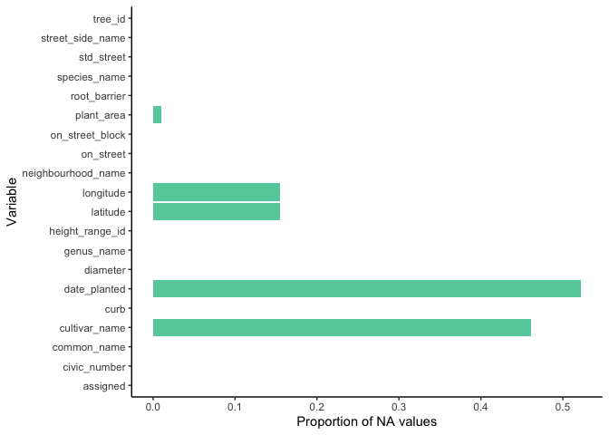
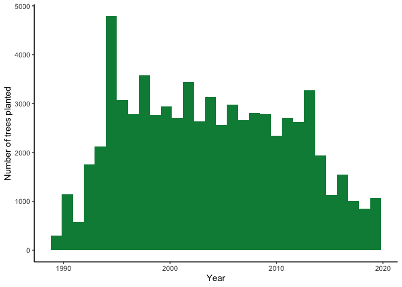
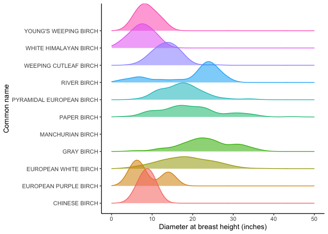

Mini Data-Analysis Deliverable 1
================
Nicola Rammell

- [Welcome to your (maybe) first-ever data analysis
  project!](#welcome-to-your-maybe-first-ever-data-analysis-project)
- [Instructions](#instructions)
  - [For Both Milestones](#for-both-milestones)
  - [For Milestone 1](#for-milestone-1)
- [Learning Objectives](#learning-objectives)
- [Task 1: Choose your favorite
  dataset](#task-1-choose-your-favorite-dataset)
  - [Explore vancouver_trees](#explore-vancouver_trees)
  - [Explore flow_sample](#explore-flow_sample)
  - [Explore building_permits](#explore-building_permits)
  - [Explore cancer_sample](#explore-cancer_sample)
- [Important note](#important-note)
- [Task 2: Exploring your dataset](#task-2-exploring-your-dataset)
  - [Introduction](#introduction)
    - [Load libraries and data](#load-libraries-and-data)
  - [Exercise 3: Investigate how many missing values there are per
    variable. Can you find a way to plot
    this?](#exercise-3-investigate-how-many-missing-values-there-are-per-variable-can-you-find-a-way-to-plot-this)
  - [Exercise 2: Create a new variable based on other variables in your
    data.](#exercise-2-create-a-new-variable-based-on-other-variables-in-your-data)
  - [Exercise 1: Plot the distribution of a numeric
    variable.](#exercise-1-plot-the-distribution-of-a-numeric-variable)
  - [Exercise 8: Use a density plot to explore any of your variables
    (that are suitable for this type of
    plot).](#exercise-8-use-a-density-plot-to-explore-any-of-your-variables-that-are-suitable-for-this-type-of-plot)
- [Task 3: Choose research questions](#task-3-choose-research-questions)
- [Overall reproducibility/Cleanliness/Coherence
  Checklist](#overall-reproducibilitycleanlinesscoherence-checklist)
  - [Coherence (0.5 points)](#coherence-05-points)
  - [Error-free code (3 points)](#error-free-code-3-points)
  - [Main README (1 point)](#main-readme-1-point)
  - [Output (1 point)](#output-1-point)
  - [Tagged release (0.5 points)](#tagged-release-05-points)
    - [Attribution](#attribution)

# Welcome to your (maybe) first-ever data analysis project!

And hopefully the first of many. Let’s get started:

1.  Install the [`datateachr`](https://github.com/UBC-MDS/datateachr)
    package by typing the following into your **R terminal**:

<!-- -->

    install.packages("devtools")
    devtools::install_github("UBC-MDS/datateachr")

2.  Load the packages below.

``` r
library(datateachr)
library(tidyverse)
```

    ## ── Attaching core tidyverse packages ──────────────────────── tidyverse 2.0.0 ──
    ## ✔ dplyr     1.1.3     ✔ readr     2.1.4
    ## ✔ forcats   1.0.0     ✔ stringr   1.5.0
    ## ✔ ggplot2   3.4.3     ✔ tibble    3.2.1
    ## ✔ lubridate 1.9.2     ✔ tidyr     1.3.0
    ## ✔ purrr     1.0.2     
    ## ── Conflicts ────────────────────────────────────────── tidyverse_conflicts() ──
    ## ✖ dplyr::filter() masks stats::filter()
    ## ✖ dplyr::lag()    masks stats::lag()
    ## ℹ Use the conflicted package (<http://conflicted.r-lib.org/>) to force all conflicts to become errors

3.  Make a repository in the <https://github.com/stat545ubc-2023>
    Organization. You can do this by following the steps found on canvas
    in the entry called [MDA: Create a
    repository](https://canvas.ubc.ca/courses/126199/pages/mda-create-a-repository).
    One completed, your repository should automatically be listed as
    part of the stat545ubc-2023 Organization.

# Instructions

## For Both Milestones

- Each milestone has explicit tasks. Tasks that are more challenging
  will often be allocated more points.

- Each milestone will be also graded for reproducibility, cleanliness,
  and coherence of the overall Github submission.

- While the two milestones will be submitted as independent
  deliverables, the analysis itself is a continuum - think of it as two
  chapters to a story. Each chapter, or in this case, portion of your
  analysis, should be easily followed through by someone unfamiliar with
  the content.
  [Here](https://swcarpentry.github.io/r-novice-inflammation/06-best-practices-R/)
  is a good resource for what constitutes “good code”. Learning good
  coding practices early in your career will save you hassle later on!

- The milestones will be equally weighted.

## For Milestone 1

**To complete this milestone**, edit [this very `.Rmd`
file](https://raw.githubusercontent.com/UBC-STAT/stat545.stat.ubc.ca/master/content/mini-project/mini-project-1.Rmd)
directly. Fill in the sections that are tagged with
`<!--- start your work below --->`.

**To submit this milestone**, make sure to knit this `.Rmd` file to an
`.md` file by changing the YAML output settings from
`output: html_document` to `output: github_document`. Commit and push
all of your work to the mini-analysis GitHub repository you made
earlier, and tag a release on GitHub. Then, submit a link to your tagged
release on canvas.

**Points**: This milestone is worth 36 points: 30 for your analysis, and
6 for overall reproducibility, cleanliness, and coherence of the Github
submission.

# Learning Objectives

By the end of this milestone, you should:

- Become familiar with your dataset of choosing
- Select 4 questions that you would like to answer with your data
- Generate a reproducible and clear report using R Markdown
- Become familiar with manipulating and summarizing your data in tibbles
  using `dplyr`, with a research question in mind.

# Task 1: Choose your favorite dataset

The `datateachr` package by Hayley Boyce and Jordan Bourak currently
composed of 7 semi-tidy datasets for educational purposes. Here is a
brief description of each dataset:

- *apt_buildings*: Acquired courtesy of The City of Toronto’s Open Data
  Portal. It currently has 3455 rows and 37 columns.

- *building_permits*: Acquired courtesy of The City of Vancouver’s Open
  Data Portal. It currently has 20680 rows and 14 columns.

- *cancer_sample*: Acquired courtesy of UCI Machine Learning Repository.
  It currently has 569 rows and 32 columns.

- *flow_sample*: Acquired courtesy of The Government of Canada’s
  Historical Hydrometric Database. It currently has 218 rows and 7
  columns.

- *parking_meters*: Acquired courtesy of The City of Vancouver’s Open
  Data Portal. It currently has 10032 rows and 22 columns.

- *steam_games*: Acquired courtesy of Kaggle. It currently has 40833
  rows and 21 columns.

- *vancouver_trees*: Acquired courtesy of The City of Vancouver’s Open
  Data Portal. It currently has 146611 rows and 20 columns.

**Things to keep in mind**

- We hope that this project will serve as practice for carrying our your
  own *independent* data analysis. Remember to comment your code, be
  explicit about what you are doing, and write notes in this markdown
  document when you feel that context is required. As you advance in the
  project, prompts and hints to do this will be diminished - it’ll be up
  to you!

- Before choosing a dataset, you should always keep in mind **your
  goal**, or in other words, *what you wish to achieve with this data*.
  This mini data-analysis project focuses on *data wrangling*,
  *tidying*, and *visualization*. In short, it’s a way for you to get
  your feet wet with exploring data on your own.

And that is exactly the first thing that you will do!

1.1 **(1 point)** Out of the 7 datasets available in the `datateachr`
package, choose **4** that appeal to you based on their description.
Write your choices below:

**Note**: We encourage you to use the ones in the `datateachr` package,
but if you have a dataset that you’d really like to use, you can include
it here. But, please check with a member of the teaching team to see
whether the dataset is of appropriate complexity. Also, include a
**brief** description of the dataset here to help the teaching team
understand your data.

<!-------------------------- Start your work below ---------------------------->

1: vancouver_trees  
2: flow_sample  
3: building_permits  
4: cancer_sample

<!----------------------------------------------------------------------------->

1.2 **(6 points)** One way to narrow down your selection is to *explore*
the datasets. Use your knowledge of dplyr to find out at least *3*
attributes about each of these datasets (an attribute is something such
as number of rows, variables, class type…). The goal here is to have an
idea of *what the data looks like*.

*Hint:* This is one of those times when you should think about the
cleanliness of your analysis. I added a single code chunk for you below,
but do you want to use more than one? Would you like to write more
comments outside of the code chunk?

<!-------------------------- Start your work below ---------------------------->

## Explore vancouver_trees

``` r
# Use dplyr::glimpse to explore vancouver_trees 
dplyr::glimpse(vancouver_trees) # dataset has 20 columns (variables) and 146,611 rows
```

    ## Rows: 146,611
    ## Columns: 20
    ## $ tree_id            <dbl> 149556, 149563, 149579, 149590, 149604, 149616, 149…
    ## $ civic_number       <dbl> 494, 450, 4994, 858, 5032, 585, 4909, 4925, 4969, 7…
    ## $ std_street         <chr> "W 58TH AV", "W 58TH AV", "WINDSOR ST", "E 39TH AV"…
    ## $ genus_name         <chr> "ULMUS", "ZELKOVA", "STYRAX", "FRAXINUS", "ACER", "…
    ## $ species_name       <chr> "AMERICANA", "SERRATA", "JAPONICA", "AMERICANA", "C…
    ## $ cultivar_name      <chr> "BRANDON", NA, NA, "AUTUMN APPLAUSE", NA, "CHANTICL…
    ## $ common_name        <chr> "BRANDON ELM", "JAPANESE ZELKOVA", "JAPANESE SNOWBE…
    ## $ assigned           <chr> "N", "N", "N", "Y", "N", "N", "N", "N", "N", "N", "…
    ## $ root_barrier       <chr> "N", "N", "N", "N", "N", "N", "N", "N", "N", "N", "…
    ## $ plant_area         <chr> "N", "N", "4", "4", "4", "B", "6", "6", "3", "3", "…
    ## $ on_street_block    <dbl> 400, 400, 4900, 800, 5000, 500, 4900, 4900, 4900, 7…
    ## $ on_street          <chr> "W 58TH AV", "W 58TH AV", "WINDSOR ST", "E 39TH AV"…
    ## $ neighbourhood_name <chr> "MARPOLE", "MARPOLE", "KENSINGTON-CEDAR COTTAGE", "…
    ## $ street_side_name   <chr> "EVEN", "EVEN", "EVEN", "EVEN", "EVEN", "ODD", "ODD…
    ## $ height_range_id    <dbl> 2, 4, 3, 4, 2, 2, 3, 3, 2, 2, 2, 5, 3, 2, 2, 2, 2, …
    ## $ diameter           <dbl> 10.00, 10.00, 4.00, 18.00, 9.00, 5.00, 15.00, 14.00…
    ## $ curb               <chr> "N", "N", "Y", "Y", "Y", "Y", "Y", "Y", "Y", "Y", "…
    ## $ date_planted       <date> 1999-01-13, 1996-05-31, 1993-11-22, 1996-04-29, 19…
    ## $ longitude          <dbl> -123.1161, -123.1147, -123.0846, -123.0870, -123.08…
    ## $ latitude           <dbl> 49.21776, 49.21776, 49.23938, 49.23469, 49.23894, 4…

``` r
                                # most columns contain character data (chr)
class(vancouver_trees)          # dataset is a tibble (tbl_df)
```

    ## [1] "tbl_df"     "tbl"        "data.frame"

The `vancouver_trees` dataset is a tibble with 20 columns and 146,611
rows. Most columns contain character data.

## Explore flow_sample

``` r
# Use dplyr::glimpse to explore flow_sample
dplyr::glimpse(flow_sample) # dataset has 7 columns (variables) and 218 rows
```

    ## Rows: 218
    ## Columns: 7
    ## $ station_id   <chr> "05BB001", "05BB001", "05BB001", "05BB001", "05BB001", "0…
    ## $ year         <dbl> 1909, 1910, 1911, 1912, 1913, 1914, 1915, 1916, 1917, 191…
    ## $ extreme_type <chr> "maximum", "maximum", "maximum", "maximum", "maximum", "m…
    ## $ month        <dbl> 7, 6, 6, 8, 6, 6, 6, 6, 6, 6, 6, 7, 6, 6, 6, 7, 5, 7, 6, …
    ## $ day          <dbl> 7, 12, 14, 25, 11, 18, 27, 20, 17, 15, 22, 3, 9, 5, 14, 5…
    ## $ flow         <dbl> 314, 230, 264, 174, 232, 214, 236, 309, 174, 345, 185, 24…
    ## $ sym          <chr> NA, NA, NA, NA, NA, NA, NA, NA, NA, NA, NA, NA, NA, NA, N…

``` r
                            # most columns contain numeric data (dbl)
class(flow_sample)          # dataset is a tibble (tbl_df)
```

    ## [1] "tbl_df"     "tbl"        "data.frame"

The `flow_sample` dataset is a tibble with 7 columns and 218 rows. Most
columns contain numeric data.

## Explore building_permits

``` r
# Use dplyr::glimpse to explore building_permits 
dplyr::glimpse(building_permits) # dataset has 14 columns (variables) and 20,680 rows
```

    ## Rows: 20,680
    ## Columns: 14
    ## $ permit_number               <chr> "BP-2016-02248", "BU468090", "DB-2016-0445…
    ## $ issue_date                  <date> 2017-02-01, 2017-02-01, 2017-02-01, 2017-…
    ## $ project_value               <dbl> 0, 0, 35000, 15000, 181178, 0, 15000, 0, 6…
    ## $ type_of_work                <chr> "Salvage and Abatement", "New Building", "…
    ## $ address                     <chr> "4378 W 9TH AVENUE, Vancouver, BC V6R 2C7"…
    ## $ project_description         <chr> NA, NA, NA, NA, NA, NA, NA, NA, NA, NA, NA…
    ## $ building_contractor         <chr> NA, NA, NA, "Mercury Contracting Ltd", "08…
    ## $ building_contractor_address <chr> NA, NA, NA, "88 W PENDER ST  \r\nUnit 2069…
    ## $ applicant                   <chr> "Raffaele & Associates DBA: Raffaele and A…
    ## $ applicant_address           <chr> "2642 East Hastings\r\nVancouver, BC  V5K …
    ## $ property_use                <chr> "Dwelling Uses", "Dwelling Uses", "Dwellin…
    ## $ specific_use_category       <chr> "One-Family Dwelling", "Multiple Dwelling"…
    ## $ year                        <dbl> 2017, 2017, 2017, 2017, 2017, 2017, 2017, …
    ## $ bi_id                       <dbl> 524, 535, 539, 541, 543, 546, 547, 548, 54…

``` r
                                 # most columns contain character data (chr)
class(building_permits)          # dataset is a tibble (spec_tbl_df)
```

    ## [1] "spec_tbl_df" "tbl_df"      "tbl"         "data.frame"

The `building_permits` dataset is a tibble with 14 columns and 20,680
rows. Most columns contain character data.

## Explore cancer_sample

``` r
# Use dplyr::glimpse to explore cancer_sample 
dplyr::glimpse(cancer_sample) # dataset has 32 columns (variables) and 569 rows
```

    ## Rows: 569
    ## Columns: 32
    ## $ ID                      <dbl> 842302, 842517, 84300903, 84348301, 84358402, …
    ## $ diagnosis               <chr> "M", "M", "M", "M", "M", "M", "M", "M", "M", "…
    ## $ radius_mean             <dbl> 17.990, 20.570, 19.690, 11.420, 20.290, 12.450…
    ## $ texture_mean            <dbl> 10.38, 17.77, 21.25, 20.38, 14.34, 15.70, 19.9…
    ## $ perimeter_mean          <dbl> 122.80, 132.90, 130.00, 77.58, 135.10, 82.57, …
    ## $ area_mean               <dbl> 1001.0, 1326.0, 1203.0, 386.1, 1297.0, 477.1, …
    ## $ smoothness_mean         <dbl> 0.11840, 0.08474, 0.10960, 0.14250, 0.10030, 0…
    ## $ compactness_mean        <dbl> 0.27760, 0.07864, 0.15990, 0.28390, 0.13280, 0…
    ## $ concavity_mean          <dbl> 0.30010, 0.08690, 0.19740, 0.24140, 0.19800, 0…
    ## $ concave_points_mean     <dbl> 0.14710, 0.07017, 0.12790, 0.10520, 0.10430, 0…
    ## $ symmetry_mean           <dbl> 0.2419, 0.1812, 0.2069, 0.2597, 0.1809, 0.2087…
    ## $ fractal_dimension_mean  <dbl> 0.07871, 0.05667, 0.05999, 0.09744, 0.05883, 0…
    ## $ radius_se               <dbl> 1.0950, 0.5435, 0.7456, 0.4956, 0.7572, 0.3345…
    ## $ texture_se              <dbl> 0.9053, 0.7339, 0.7869, 1.1560, 0.7813, 0.8902…
    ## $ perimeter_se            <dbl> 8.589, 3.398, 4.585, 3.445, 5.438, 2.217, 3.18…
    ## $ area_se                 <dbl> 153.40, 74.08, 94.03, 27.23, 94.44, 27.19, 53.…
    ## $ smoothness_se           <dbl> 0.006399, 0.005225, 0.006150, 0.009110, 0.0114…
    ## $ compactness_se          <dbl> 0.049040, 0.013080, 0.040060, 0.074580, 0.0246…
    ## $ concavity_se            <dbl> 0.05373, 0.01860, 0.03832, 0.05661, 0.05688, 0…
    ## $ concave_points_se       <dbl> 0.015870, 0.013400, 0.020580, 0.018670, 0.0188…
    ## $ symmetry_se             <dbl> 0.03003, 0.01389, 0.02250, 0.05963, 0.01756, 0…
    ## $ fractal_dimension_se    <dbl> 0.006193, 0.003532, 0.004571, 0.009208, 0.0051…
    ## $ radius_worst            <dbl> 25.38, 24.99, 23.57, 14.91, 22.54, 15.47, 22.8…
    ## $ texture_worst           <dbl> 17.33, 23.41, 25.53, 26.50, 16.67, 23.75, 27.6…
    ## $ perimeter_worst         <dbl> 184.60, 158.80, 152.50, 98.87, 152.20, 103.40,…
    ## $ area_worst              <dbl> 2019.0, 1956.0, 1709.0, 567.7, 1575.0, 741.6, …
    ## $ smoothness_worst        <dbl> 0.1622, 0.1238, 0.1444, 0.2098, 0.1374, 0.1791…
    ## $ compactness_worst       <dbl> 0.6656, 0.1866, 0.4245, 0.8663, 0.2050, 0.5249…
    ## $ concavity_worst         <dbl> 0.71190, 0.24160, 0.45040, 0.68690, 0.40000, 0…
    ## $ concave_points_worst    <dbl> 0.26540, 0.18600, 0.24300, 0.25750, 0.16250, 0…
    ## $ symmetry_worst          <dbl> 0.4601, 0.2750, 0.3613, 0.6638, 0.2364, 0.3985…
    ## $ fractal_dimension_worst <dbl> 0.11890, 0.08902, 0.08758, 0.17300, 0.07678, 0…

``` r
                              # most columns contain numeric data (dbl)
class(cancer_sample)          # dataset is a tibble (spec_tbl_df)
```

    ## [1] "spec_tbl_df" "tbl_df"      "tbl"         "data.frame"

The `cancer_sample` dataset is a tibble with 32 columns and 569 rows.
Most columns contain numeric data.

<!----------------------------------------------------------------------------->

1.3 **(1 point)** Now that you’ve explored the 4 datasets that you were
initially most interested in, let’s narrow it down to 1. What lead you
to choose this one? Briefly explain your choice below.

<!-------------------------- Start your work below ---------------------------->

I have decided to use the `vancouver_trees` dataset for my project. Of
the four datasets that I explored, this dataset had the most
observations, with 146,611 rows of data. This dataset also contains
numerous variables of interest, with a mixture of character data (such
as species names and street names) and numeric data (such as tree
diameter). Overall, I chose this dataset because of its large size,
relative completeness, and because I am ultimately interested in
learning more about the trees of Vancouver. Specifically, I am
interested in how tree biodiversity and species identity vary over space
and time.

<!----------------------------------------------------------------------------->

1.4 **(2 points)** Time for a final decision! Going back to the
beginning, it’s important to have an *end goal* in mind. For example, if
I had chosen the `titanic` dataset for my project, I might’ve wanted to
explore the relationship between survival and other variables. Try to
think of 1 research question that you would want to answer with your
dataset. Note it down below.

<!-------------------------- Start your work below ---------------------------->

**Research Question:** Do tree communities in Vancouver differ by
neighborhood?

<!----------------------------------------------------------------------------->

# Important note

Read Tasks 2 and 3 *fully* before starting to complete either of them.
Probably also a good point to grab a coffee to get ready for the fun
part!

This project is semi-guided, but meant to be *independent*. For this
reason, you will complete tasks 2 and 3 below (under the **START HERE**
mark) as if you were writing your own exploratory data analysis report,
and this guidance never existed! Feel free to add a brief introduction
section to your project, format the document with markdown syntax as you
deem appropriate, and structure the analysis as you deem appropriate. If
you feel lost, you can find a sample data analysis
[here](https://www.kaggle.com/headsortails/tidy-titarnic) to have a
better idea. However, bear in mind that it is **just an example** and
you will not be required to have that level of complexity in your
project.

# Task 2: Exploring your dataset

If we rewind and go back to the learning objectives, you’ll see that by
the end of this deliverable, you should have formulated *4* research
questions about your data that you may want to answer during your
project. However, it may be handy to do some more exploration on your
dataset of choice before creating these questions - by looking at the
data, you may get more ideas. **Before you start this task, read all
instructions carefully until you reach START HERE under Task 3**.

2.1 **(12 points)** Complete *4 out of the following 8 exercises* to
dive deeper into your data. All datasets are different and therefore,
not all of these tasks may make sense for your data - which is why you
should only answer *4*.

Make sure that you’re using dplyr and ggplot2 rather than base R for
this task. Outside of this project, you may find that you prefer using
base R functions for certain tasks, and that’s just fine! But part of
this project is for you to practice the tools we learned in class, which
is dplyr and ggplot2.

1.  Plot the distribution of a numeric variable.
2.  Create a new variable based on other variables in your data (only if
    it makes sense)
3.  Investigate how many missing values there are per variable. Can you
    find a way to plot this?
4.  Explore the relationship between 2 variables in a plot.
5.  Filter observations in your data according to your own criteria.
    Think of what you’d like to explore - again, if this was the
    `titanic` dataset, I may want to narrow my search down to passengers
    born in a particular year…
6.  Use a boxplot to look at the frequency of different observations
    within a single variable. You can do this for more than one variable
    if you wish!
7.  Make a new tibble with a subset of your data, with variables and
    observations that you are interested in exploring.
8.  Use a density plot to explore any of your variables (that are
    suitable for this type of plot).

2.2 **(4 points)** For each of the 4 exercises that you complete,
provide a *brief explanation* of why you chose that exercise in relation
to your data (in other words, why does it make sense to do that?), and
sufficient comments for a reader to understand your reasoning and code.

<!-------------------------- Start your work below ---------------------------->

## Introduction

For Task 2, I will complete Exercises 3, 2, 1, and 8. These are
completed out of order because I decided to assess missing data first,
create a new variable second, plot the distribution of this variable
third, and lastly, create a density plot of another variable. All
exercises are completed with the `vancouver_trees` dataset from
`datateachr` using the `dplyr` and `ggplot2` packages.

### Load libraries and data

``` r
# Load libraries 
library(devtools)                                # package development tools
```

    ## Loading required package: usethis

``` r
# devtools::install_github("UBC-MDS/datateachr") # install datateachr from GitHub
library(datateachr)                              # package containing the dataset
library(tidyverse)                               # set of packages for tidy data
library(ggplot2)                                 # package for data visualization
library(ggridges)                                # package for ridgeline plots

# Load and view dataset
trees <- datateachr::vancouver_trees             # create object for the dataset
dplyr::glimpse(trees)                            # explore tibble characteristics
```

    ## Rows: 146,611
    ## Columns: 20
    ## $ tree_id            <dbl> 149556, 149563, 149579, 149590, 149604, 149616, 149…
    ## $ civic_number       <dbl> 494, 450, 4994, 858, 5032, 585, 4909, 4925, 4969, 7…
    ## $ std_street         <chr> "W 58TH AV", "W 58TH AV", "WINDSOR ST", "E 39TH AV"…
    ## $ genus_name         <chr> "ULMUS", "ZELKOVA", "STYRAX", "FRAXINUS", "ACER", "…
    ## $ species_name       <chr> "AMERICANA", "SERRATA", "JAPONICA", "AMERICANA", "C…
    ## $ cultivar_name      <chr> "BRANDON", NA, NA, "AUTUMN APPLAUSE", NA, "CHANTICL…
    ## $ common_name        <chr> "BRANDON ELM", "JAPANESE ZELKOVA", "JAPANESE SNOWBE…
    ## $ assigned           <chr> "N", "N", "N", "Y", "N", "N", "N", "N", "N", "N", "…
    ## $ root_barrier       <chr> "N", "N", "N", "N", "N", "N", "N", "N", "N", "N", "…
    ## $ plant_area         <chr> "N", "N", "4", "4", "4", "B", "6", "6", "3", "3", "…
    ## $ on_street_block    <dbl> 400, 400, 4900, 800, 5000, 500, 4900, 4900, 4900, 7…
    ## $ on_street          <chr> "W 58TH AV", "W 58TH AV", "WINDSOR ST", "E 39TH AV"…
    ## $ neighbourhood_name <chr> "MARPOLE", "MARPOLE", "KENSINGTON-CEDAR COTTAGE", "…
    ## $ street_side_name   <chr> "EVEN", "EVEN", "EVEN", "EVEN", "EVEN", "ODD", "ODD…
    ## $ height_range_id    <dbl> 2, 4, 3, 4, 2, 2, 3, 3, 2, 2, 2, 5, 3, 2, 2, 2, 2, …
    ## $ diameter           <dbl> 10.00, 10.00, 4.00, 18.00, 9.00, 5.00, 15.00, 14.00…
    ## $ curb               <chr> "N", "N", "Y", "Y", "Y", "Y", "Y", "Y", "Y", "Y", "…
    ## $ date_planted       <date> 1999-01-13, 1996-05-31, 1993-11-22, 1996-04-29, 19…
    ## $ longitude          <dbl> -123.1161, -123.1147, -123.0846, -123.0870, -123.08…
    ## $ latitude           <dbl> 49.21776, 49.21776, 49.23938, 49.23469, 49.23894, 4…

``` r
# summary(trees)                                 # to see variable characteristics/NAs
View(trees)                                      # see complete tibble in new window
```

## Exercise 3: Investigate how many missing values there are per variable. Can you find a way to plot this?

**Explanation**: I will begin with Exercise 3 because the first way I
wish to explore the dataset is to investigate the number of NA values
for each of the columns. With 146,611 rows of data, scrolling through
the observations and noting NA frequency is not feasible. Therefore, it
makes sense to calculate the number of NAs using code and plot the
proportion of NA cells in order to visualize how much of the data is
missing. The number of NAs can be viewed using the base::summary
function as seen above, but here we will use `dplyr` to achieve our
desired result.

``` r
# Count number of NAs for each variable and calculate proportion of missing data 
na <- trees %>%
  dplyr::summarise(across(everything(), list(~ sum(is.na(.))))) %>%  # count up NAs
  dplyr::rename_with(~str_remove(., '_1')) %>%                       # remove _1 suffix
  tidyr::pivot_longer(cols = everything(),                           # pivot dataframe
               names_to = "variable_name", 
               values_to = "number_na") %>%                   # number of NAs to a column
  dplyr::mutate(proportion_na = number_na/(nrow(trees)))      # add proportion NAs column
print(na)
```

    ## # A tibble: 20 × 3
    ##    variable_name      number_na proportion_na
    ##    <chr>                  <int>         <dbl>
    ##  1 tree_id                    0        0     
    ##  2 civic_number               0        0     
    ##  3 std_street                 0        0     
    ##  4 genus_name                 0        0     
    ##  5 species_name               0        0     
    ##  6 cultivar_name          67559        0.461 
    ##  7 common_name                0        0     
    ##  8 assigned                   0        0     
    ##  9 root_barrier               0        0     
    ## 10 plant_area              1486        0.0101
    ## 11 on_street_block            0        0     
    ## 12 on_street                  0        0     
    ## 13 neighbourhood_name         0        0     
    ## 14 street_side_name           0        0     
    ## 15 height_range_id            0        0     
    ## 16 diameter                   0        0     
    ## 17 curb                       0        0     
    ## 18 date_planted           76548        0.522 
    ## 19 longitude              22771        0.155 
    ## 20 latitude               22771        0.155

``` r
# Next, I will plot the proportion of missing data for each variable 
ggplot(na, aes(x = variable_name, y = proportion_na)) +     
 geom_bar(stat = "identity", fill = "aquamarine3") +
 coord_flip() +
 theme_classic() +
 xlab("Variable") + ylab("Proportion of NA values")
```

<!-- -->

**Summary**: Plotting the proportion of NA values for each variable is
an effective way to visualize how much data is missing from this
dataset. Many variables do not have any missing values, while
`plant area` has little missing data (~1%), `latitude` and `longitude`
have an intermediate amount of missing data (~15%), and `date planted`
and `cultivar name` have a substantial amount of missing data (~50%). If
we plan on using the latter two variables for an analysis, we’d need to
be cautious since so much data is missing.

**Note**: Beyond using the `is.na` argument, further quality control
should be done while assessing missing values from the dataset. For
example, in my initial viewing of `summary(trees)` when reading in the
data (as seen above), I noticed that the `diameter` variable ranges from
0.00 to 435.00. Let’s take a closer look using the `dplyr::count`
function.

``` r
# Count number of unique diameter values
trees %>%
  count(diameter) 
```

    ## # A tibble: 520 × 2
    ##    diameter     n
    ##       <dbl> <int>
    ##  1     0       92
    ##  2     0.25     6
    ##  3     0.5     22
    ##  4     0.75     2
    ##  5     0.8      1
    ##  6     1       60
    ##  7     1.05     1
    ##  8     1.25    10
    ##  9     1.3      2
    ## 10     1.5     76
    ## # ℹ 510 more rows

While most observations have a realistic diameter value, some do not. In
fact, for 92 trees, a diameter of 0 was recorded. And, there are some
instances of unreasonably large diameters, such as the maximum recorded
diameter of 435.00 inches. Since these values appear to be measurement
or data entry errors, and not NAs, I will leave Exercise 3 as-is.
However, this observation is important in considering how the data
should be filtered for validity before future analyses.

## Exercise 2: Create a new variable based on other variables in your data.

**Explanation**: Now that I am aware of the missing data in this
dataset, I will move on to some exploratory visualization of the data.
However, I will first create a new variable that I am interested in
exploring: `year planted`. I will create this variable based on the
`date planted` variable, by splitting up the date into multiple columns.

``` r
# Create new variables (year, month, day) based off the date column in the dataset
trees2 <- trees %>%
  dplyr::mutate(year_planted = lubridate::year(date_planted),   # create year column
                month_planted = lubridate::month(date_planted), # create month column 
                day_planted = lubridate::day(date_planted))     # create day column
View(trees2) # check that 3 new columns have been created 
```

**Summary**: I used dplyr::mutate to create new columns with the
`lubridate` package in order to parse dates. The `trees2` dataset now
has 3 new columns; I will be using the new `year` column in the next
exercise.

## Exercise 1: Plot the distribution of a numeric variable.

**Explanation**: I am interested in plotting the distribution of
`year planted`. I have chosen to do this because `year planted` is a
numeric variable and I am interested in exploring when most trees in
Vancouver were planted. I will plot the distribution using a histogram.

``` r
# Check that year_planted is a numeric variable 
dplyr::glimpse(trees2)   # using dplyr::glimpse, I see that is it (dbl)
```

    ## Rows: 146,611
    ## Columns: 23
    ## $ tree_id            <dbl> 149556, 149563, 149579, 149590, 149604, 149616, 149…
    ## $ civic_number       <dbl> 494, 450, 4994, 858, 5032, 585, 4909, 4925, 4969, 7…
    ## $ std_street         <chr> "W 58TH AV", "W 58TH AV", "WINDSOR ST", "E 39TH AV"…
    ## $ genus_name         <chr> "ULMUS", "ZELKOVA", "STYRAX", "FRAXINUS", "ACER", "…
    ## $ species_name       <chr> "AMERICANA", "SERRATA", "JAPONICA", "AMERICANA", "C…
    ## $ cultivar_name      <chr> "BRANDON", NA, NA, "AUTUMN APPLAUSE", NA, "CHANTICL…
    ## $ common_name        <chr> "BRANDON ELM", "JAPANESE ZELKOVA", "JAPANESE SNOWBE…
    ## $ assigned           <chr> "N", "N", "N", "Y", "N", "N", "N", "N", "N", "N", "…
    ## $ root_barrier       <chr> "N", "N", "N", "N", "N", "N", "N", "N", "N", "N", "…
    ## $ plant_area         <chr> "N", "N", "4", "4", "4", "B", "6", "6", "3", "3", "…
    ## $ on_street_block    <dbl> 400, 400, 4900, 800, 5000, 500, 4900, 4900, 4900, 7…
    ## $ on_street          <chr> "W 58TH AV", "W 58TH AV", "WINDSOR ST", "E 39TH AV"…
    ## $ neighbourhood_name <chr> "MARPOLE", "MARPOLE", "KENSINGTON-CEDAR COTTAGE", "…
    ## $ street_side_name   <chr> "EVEN", "EVEN", "EVEN", "EVEN", "EVEN", "ODD", "ODD…
    ## $ height_range_id    <dbl> 2, 4, 3, 4, 2, 2, 3, 3, 2, 2, 2, 5, 3, 2, 2, 2, 2, …
    ## $ diameter           <dbl> 10.00, 10.00, 4.00, 18.00, 9.00, 5.00, 15.00, 14.00…
    ## $ curb               <chr> "N", "N", "Y", "Y", "Y", "Y", "Y", "Y", "Y", "Y", "…
    ## $ date_planted       <date> 1999-01-13, 1996-05-31, 1993-11-22, 1996-04-29, 19…
    ## $ longitude          <dbl> -123.1161, -123.1147, -123.0846, -123.0870, -123.08…
    ## $ latitude           <dbl> 49.21776, 49.21776, 49.23938, 49.23469, 49.23894, 4…
    ## $ year_planted       <dbl> 1999, 1996, 1993, 1996, 1993, NA, 1993, 1993, 1993,…
    ## $ month_planted      <dbl> 1, 5, 11, 4, 12, NA, 12, 12, 12, 12, 12, 12, 12, 11…
    ## $ day_planted        <int> 13, 31, 22, 29, 17, NA, 16, 16, 16, 3, 3, 3, 15, 19…

``` r
# str(trees2)            # alternatively, could check using str (num)
```

``` r
# Plot the distribution of year_planted using a histogram 
ggplot(trees2, aes(year_planted)) +
   geom_histogram(aes(y = after_stat(count)),  # number of points in bin
                  fill = "springgreen4", 
                  bins = 30,                   # the number of bins
                  na.rm = TRUE) +              # removing the 76548 rows with NAs
   theme_classic() +
   xlab("Year") + ylab("Number of trees planted") 
```

<!-- -->

**Summary**: The above plot shows the distribution of the variable
`year planted`. We can see that from the beginning of the dataset in
1989, the number of trees that were planted in a given year initially
increased over time. The number of trees planted seems to peak in the
mid-late 1990s, after which the number of trees planted plateaus until
the early 2010s, after which point the number of trees planted in a
given year declines.

## Exercise 8: Use a density plot to explore any of your variables (that are suitable for this type of plot).

**Explanation**: Finally, I am interested in exploring tree `diameter`
of tree species. In order to do this, I will create a ridgeline plot
using the `ggridges` package. I will plot the `diameter` data for a
subset of the data that I am particularly intested in, since the full
dataset contains 634 species belonging to 97 genera!

``` r
# First, let's confirm how many observations per species there are 
trees2 %>%
  count(common_name) # there are 634 species in this dataset 
```

    ## # A tibble: 634 × 2
    ##    common_name                   n
    ##    <chr>                     <int>
    ##  1 ACCOLADE CHERRY              60
    ##  2 AKEBONO FLOWERING CHERRY   2384
    ##  3 ALDER SPECIES                16
    ##  4 ALDERLEAFED MOUNTAIN ASH    172
    ##  5 ALIA'S MAGNOLIA               3
    ##  6 ALLEGHENY SERVICEBERRY        6
    ##  7 ALLGOLD EUROPEAN ASH         78
    ##  8 ALMIRA NORWAY MAPLE           9
    ##  9 ALPINE FIR                    1
    ## 10 AMANOGAWA JAPANESE CHERRY    68
    ## # ℹ 624 more rows

``` r
# Next, let's confirm how many observations per genus there are 
trees2 %>%
  count(genus_name) # there are 97 genera in this dataset
```

    ## # A tibble: 97 × 2
    ##    genus_name      n
    ##    <chr>       <int>
    ##  1 ABIES         190
    ##  2 ACER        36062
    ##  3 AESCULUS     2570
    ##  4 AILANTHUS       4
    ##  5 ALBIZIA         1
    ##  6 ALNUS          74
    ##  7 AMELANCHIER   226
    ##  8 ARALIA          4
    ##  9 ARAUCARIA      10
    ## 10 ARBUTUS        10
    ## # ℹ 87 more rows

I am interested in exploring tree diameter for *Betula* (aka Birch), a
genus which is commonly found in my study system!

``` r
# What is the range of trunk diameters for Betula species? 
trees2 %>% 
   dplyr::filter(genus_name == "BETULA") %>% 
   dplyr::select(diameter) %>%
   summary() # values range from 2 to 48 inches (DBH); values seem legitimate 
```

    ##     diameter    
    ##  Min.   : 2.00  
    ##  1st Qu.:13.00  
    ##  Median :17.50  
    ##  Mean   :17.85  
    ##  3rd Qu.:23.00  
    ##  Max.   :48.00

Note that units were not provided in the dataset, but are found in the
[metadata](https://opendata.vancouver.ca/explore/dataset/street-trees/information/?disjunctive.species_name&disjunctive.common_name&disjunctive.on_street&disjunctive.neighbourhood_name)
from the City of Vancouver. Diameter is measured as diameter at breast
height (DBH): diameter in inches at a height of 1.3 meters.

Finally, let’s make the density plot for trunk diameter of *Betula*
species.

``` r
# Create density (ridgeline) plot for Betula using ggridges 
trees2 %>% 
   filter(genus_name == "BETULA") %>% 
   ggplot(aes(colour = common_name, 
              fill = common_name, 
              alpha = 0.5,  # defines transparency
              x = diameter, 
              y = common_name)) +
   ggridges::geom_density_ridges() + 
   xlim(0, 50) +            # define x-axis as 0 to 50, based on the known range
   theme_classic() +
   theme(legend.position = "none") +
   xlab("Diameter at breast height (inches)") + ylab("Common name")
```

    ## Picking joint bandwidth of 1.98

<!-- -->

**Summary**: The Exercise 8 plot shows kernel density estimates of
diameter for different species in the *Betula* genus. According to the
plot, species such as River Birch (*Betula nigra*) and Gray Birch
(*Betula populifolia*) had large diameters at the time of planting,
whereas species such as Young’s Weeping Birch (*Betula pendula*) and
While Himalayan Birch (*Betula jacquemontii*) had small diameters at the
time of planting.

<!----------------------------------------------------------------------------->

# Task 3: Choose research questions

**(4 points)** So far, you have chosen a dataset and gotten familiar
with it through exploring the data. You have also brainstormed one
research question that interested you (Task 1.4). Now it’s time to pick
4 research questions that you would like to explore in Milestone 2!
Write the 4 questions and any additional comments below.

<!--- *****START HERE***** --->

**Research Questions:**

1.  What is the distribution of common and rare tree species in
    Vancouver, BC?  
2.  Does tree community composition differ by neighborhood?  
3.  How does tree species richness vary by neighborhood?  
4.  Have the species identity of planted trees changed over time?

<!----------------------------->

# Overall reproducibility/Cleanliness/Coherence Checklist

## Coherence (0.5 points)

The document should read sensibly from top to bottom, with no major
continuity errors. An example of a major continuity error is having a
data set listed for Task 3 that is not part of one of the data sets
listed in Task 1.

## Error-free code (3 points)

For full marks, all code in the document should run without error. 1
point deduction if most code runs without error, and 2 points deduction
if more than 50% of the code throws an error.

## Main README (1 point)

There should be a file named `README.md` at the top level of your
repository. Its contents should automatically appear when you visit the
repository on GitHub.

Minimum contents of the README file:

- In a sentence or two, explains what this repository is, so that
  future-you or someone else stumbling on your repository can be
  oriented to the repository.
- In a sentence or two (or more??), briefly explains how to engage with
  the repository. You can assume the person reading knows the material
  from STAT 545A. Basically, if a visitor to your repository wants to
  explore your project, what should they know?

Once you get in the habit of making README files, and seeing more README
files in other projects, you’ll wonder how you ever got by without them!
They are tremendously helpful.

## Output (1 point)

All output is readable, recent and relevant:

- All Rmd files have been `knit`ted to their output md files.
- All knitted md files are viewable without errors on Github. Examples
  of errors: Missing plots, “Sorry about that, but we can’t show files
  that are this big right now” messages, error messages from broken R
  code
- All of these output files are up-to-date – that is, they haven’t
  fallen behind after the source (Rmd) files have been updated.
- There should be no relic output files. For example, if you were
  knitting an Rmd to html, but then changed the output to be only a
  markdown file, then the html file is a relic and should be deleted.

(0.5 point deduction if any of the above criteria are not met. 1 point
deduction if most or all of the above criteria are not met.)

Our recommendation: right before submission, delete all output files,
and re-knit each milestone’s Rmd file, so that everything is up to date
and relevant. Then, after your final commit and push to Github, CHECK on
Github to make sure that everything looks the way you intended!

## Tagged release (0.5 points)

You’ve tagged a release for Milestone 1.

### Attribution

Thanks to Icíar Fernández Boyano for mostly putting this together, and
Vincenzo Coia for launching.
